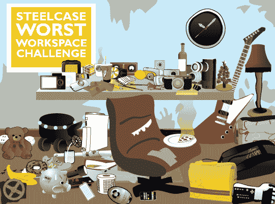

# Steelcase 最差工作空间挑战更新

> 原文：<https://web.archive.org/web/http://techcrunch.com/2007/02/21/steelcase-worst-workspace-challenge-update/>

唉。狂欢节结束了，但我的宿醉才刚刚开始。举行了许多醉酒的庆祝活动。你可以在我的 [Flickr 页面](https://web.archive.org/web/20150916080941/http://www.flickr.com/photos/blakevsworld/sets/72157594547609621/)看到我的照片。

总之，关于 Steelcase 最差工作空间挑战的快速更新。到目前为止，我们已经收到了许多优秀的参赛作品，我希望它们会继续出现——我确信我们会在本周末收到一大批这样的作品。

那么如何进入呢？

这件事的奖项是令人难以置信的，我真的不能再兴奋了。大奖是一把全新的钢制椅子。获胜者可以选择任何可用的思考椅或任何 Leap chair，但不包括皮革椅(所以基本上你可以在黑色或铂金面料 Leaps 之间选择)。这些椅子的价值约为 900 美元，你可以选择你的封面颜色。我最近回顾了一个飞跃，它几乎是有史以来最伟大的事情。

我们也有四个亚军的位置。我们在 iFrogz 的朋友提供了四种礼品卡，可以让您选择自己喜欢的 iPod 保护套。这些案子很热门。

现在说说规则。要进入，我们需要最差工作场所的照片。这包括你的桌子、椅子、一般的工作环境等。我们希望看到灾难。到处都是纸，口香糖粘在东西上，咖啡洒了，椅子坏了，桌子砸了，等等。它必须是糟糕的，大写的 b。把你的参赛作品发到 crunchgear dot com 上，以“最糟糕的工作空间挑战”为主题。

只接受原始工作区图片。考虑到这一点，请提交多张您的工作区照片。多张照片将有助于确保真实性，并让我们更好地了解您的工作环境有多差。

工作环境最差的人将会赢得一把全新的钢制椅子，帮助你稍微改善一下糟糕的环境。而且，虽然 iFrogz 案例不会让您的工作环境变得更好，但它至少会帮助您少关心一点灾难。

我们将运行这一个直到下周一，所以开始工作。