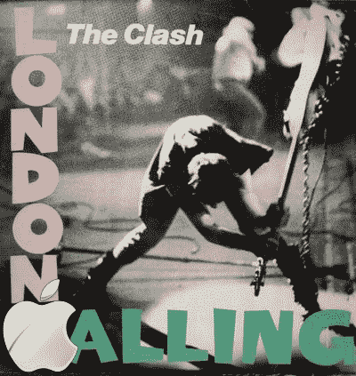

# 史蒂夫·乔布斯现身伦敦，可能与欧洲 iPhone 发布会有关

> 原文：<https://web.archive.org/web/http://techcrunch.com/2007/07/09/steve-jobs-spotted-in-london-possibly-related-to-european-iphone-launch/>

# 史蒂夫·乔布斯现身伦敦，可能与欧洲 iPhone 发布有关

史蒂夫·乔布斯昨天参观了伦敦。他可能只是在那里闲逛，给自己弄一个漂亮的伦敦日光浴，或者他可能，*可能*已经在那里敲定(注意英式拼写)围绕 [iPhone](https://web.archive.org/web/20130628175856/http://crunchgear.com/category/iphone/) 在欧洲发布的细节。苹果伦敦零售店的一部分将于下周一关闭，这导致一些人预测届时将会发布 iPhone。兴奋！

当然，如果你在欧洲，迫不及待地想看到一部活生生的 iPhone，不要忘了我们的“工具人”约翰·比格斯很快就会来到布达佩斯，很有可能会展示 iPhone。他可能穿也可能不穿裤子。

[英国伦敦乔布斯即将发布 iPhone？](https://web.archive.org/web/20130628175856/http://ilounge.com/index.php/news/comments/jobs-in-london-uk-iphone-announcement-imminent/)【iLounge】