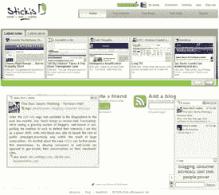

# Stickis 推出联合网络注释器

> 原文：<https://web.archive.org/web/http://www.techcrunch.com:80/2006/11/28/stickis-launches-syndicated-web-note-taker/>

# Stickis 推出联合网络注释器

 [Stickis](https://web.archive.org/web/20211205075108/http://stickis.com/) ，我们[在去年 10 月简要介绍过](https://web.archive.org/web/20211205075108/http://www.beta.techcrunch.com/2005/10/24/annotating-your-web-with-stickis/)今天下午推出服务。Stickis 乍一看是一个 FireFox 和 Internet Explorer 插件，很像其他 web 注释程序，如 [Fleck](https://web.archive.org/web/20211205075108/http://www.beta.techcrunch.com/2006/11/16/fleck-offers-zero-friction-web-annotation/) 、 [Diigo](https://web.archive.org/web/20211205075108/http://www.beta.techcrunch.com/2006/08/02/diigo-is-a-research-tool-that-rocks/#more-2365) 和 [Trailfire](https://web.archive.org/web/20211205075108/http://www.beta.techcrunch.com/2006/08/16/blaze-away-with-trailfire/) 。Stickis 确实做了这些程序的网页“便签”注释。然而，Stickis 不仅仅是标记一个页面。它是关于创建和订阅这些笔记和其他数据源的“通道”。

这些频道可以包括人们留下的笔记、RSS 提要(博客)，甚至是 OpenTable 或 Yelp 等 web 服务的专用数据频道。当你订阅一个频道时，无论是另一个用户的“便笺”还是 Yelp 评论，该频道都会被添加到你的网络中，并开始按时间倒序填充一个隐藏在浏览器屏幕一侧的可折叠托盘。然后，当你访问一个页面时，比如 TechCrunch，通过分析你当前页面的 url 和标签以及那些包含在注释中的内容，托盘中会有来自你的网络的任何相关注释或评论的摘要。在摘要上点击一下，就会弹出便签。

 Stickis 对 OpenTable 和 Yelp 等 web 服务渠道进行了更深入的分析，这使得当我进入链接到餐厅的页面时，餐厅的 Yelp 评论和 OpenTable 预订搜索小部件可能会在我的托盘中弹出。我相信这种上下文方法使它比其他方法更容易消费，其他方法要求你通过访问带注释的页面主动寻找信息。由于基于订阅的方法，它还允许更好地控制您看到的数据。

创建笔记是通过一个相当强大的 WISIWYG 编辑器完成的，允许用户设计文本和背景，以及通过拖放嵌入照片和电影。这使得浏览 Flickr 并开始评论变得非常容易。在没有安装插件的情况下，用户仍然可以使用该网站的代理版本，AJAX 版本的 Stickis 在上面，就像这个一样。当他们链接到博客时，可以回复一个或几个笔记，甚至留下引用通告，因为你的个人 Stickis 频道页面实际上是一个个人博客，笔记在那里被存储为标签文章。这也可以改为发布到个人博客。回复便笺不会堵塞你的托盘，因为你只能看到你订阅的频道。但是，您会看到有人回复了一条注释，并且可以点击查看。如果你看到你喜欢的东西，你可以将笔记的创建者添加到你的渠道网络中。

Stickis 总部位于旧金山，目前由大约 100 万美元的天使融资资助。他们计划通过 Stickis 的第三种内容渠道:网络服务来赚钱。人们希望 Stickis 能为冲浪者提供一种更容易、更相关的方式来获取出版商的内容，为他们的网站带来更多流量，并使用他们的服务。Yelp 和 OpenTable 是他们测试的第一个垂直平台。很容易想象其他一些垂直市场，如音乐会门票销售或旅游住宿。没有具体谈到支付将如何构成，但代销费似乎是最明智的。

你可以通过下面的链接获得 Stickis 或者在 TechCrunch 上预览这项服务:
