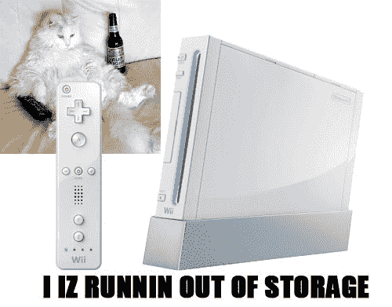

# Wii  出现存储问题

> 原文：<https://web.archive.org/web/http://techcrunch.com:80/2007/06/12/storage-problems-arising-on-the-wii/>

你认为你的 Wii 真的是一个特殊的游戏机，不是吗？当然，它不能播放 DVD，也没有硬盘，但这没关系，因为 Wii 有一个遥控器！现在，Wii 的拥有者们痛苦地发现，没有硬盘真糟糕。8BitJoystick.com 的杰克下载了太多的 VC 游戏，并意识到他的 Wii 频道已满，他的内部存储几乎达到了 512MB 的极限。哎哟。

杰克也没有发疯似的下载任天堂虚拟游戏机上的每一款游戏。他只是像其他玩家一样下载了正常数量的游戏。问题在于任天堂发行旧游戏的方式。每个 VC 游戏不仅包括游戏运行所需的 ROM 文件，还包含一个模拟器。因此，当你下载的每款游戏都附带一个程序时，存储空间将很快耗尽。

任天堂需要找到一种新的存储解决方案，而且要快，如果它有任何希望，不要让玩家在下载新游戏时，发现他们的 Wii 已经没有空间容纳它们。当然，你可以备份到 SD 卡上，但是那不实际，而且很贵。或许一个大规模的 USB 存储解决方案正在酝酿之中？

[我的 Wii 满了](https://web.archive.org/web/20160301141309/http://www.8bitjoystick.com/archives/jake_my_wii_is_full.php)