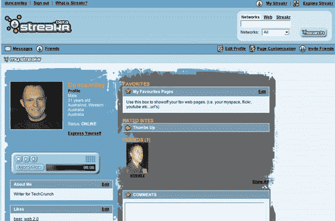

# 裸奔发布会:MySpace+stumble upon = Something–TechCrunch

> 原文：<https://web.archive.org/web/http://www.techcrunch.com:80/2007/07/16/streakr-launches-myspace-stumbleupon-something/>

# 裸奔发布:MySpace + StumbleUpon =什么

 [【裸奔者】](https://web.archive.org/web/20220112004907/http://www.streakr.com/)，一个在私下测试中引起很多议论的网站(我们已经报道过两次[之前](https://web.archive.org/web/20220112004907/http://www.beta.techcrunch.com/2007/03/15/streakr-search-makes-social-networks-bare-all/))今天在测试版中发布。

裸奔的定位如下:

> 裸奔带给用户最好的网络。他们只需在浏览器上下载一个“发现”栏，只需轻触按钮，就能找到数十个符合他们兴趣的新网站。然后，他们可以通过在网站上打上“拇指向上”或“拇指向下”的图标，来评价他们喜欢和不喜欢的网站。一旦被选中，URL 将被保存到他们的个人资料页面上，并被编入索引以供将来参考。用户也可以查看这些网站，然后可以通过社交网络与裸奔者分享。

描述裸奔者最礼貌的方式是:MySpace 和 StumbleUpon 在一起，有了一个学习障碍的孩子。

当裸奔在 3 月份首次被提及时，它被认为是一个有“态度”的网站，然而裸奔提供的唯一态度是一个看起来与 MySpace 几乎相同(完全是丑陋的个人资料页面)但缺乏几乎所有功能的社交网络。然后是网站浏览/工具栏功能，它只不过是一个克隆版的 StumbleUpon。用户也可以在其他社交网站上搜索朋友，但是为什么有人会通过裸奔而不是谷歌搜索其他网站上的朋友，或者社交网站本身没有得到解释，也没有聚合工具可以使这成为一个有趣的功能。

公平地说，这只是一个测试版，所以也许裸奔将在未来推出一个更引人注目的产品，但显然宣传在现实中没有位置。如果你一直想成为围绕 StumpleUpon 风格服务建立的社交网络的一部分，你可能会从裸奔中找到一些乐趣，对于我们其他人来说；没什么可看的。
