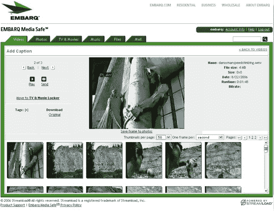

# 免费演出:通过 ISP Embarq 简化团队

> 原文：<https://web.archive.org/web/http://www.techcrunch.com/2006/09/18/streamload-media-max-partners-with-isp-embarq/http://www.techcrunch.com/2006/09/18/streamload-media-max-partners-with-isp-embarq/>

在线存储公司 [Streamload](https://web.archive.org/web/20080829150349/http://www.streamload.com/) 已经签署了一项协议，为 ISP [Embarq](https://web.archive.org/web/20080829150349/http://www.embarq.com/) 的客户提供文件存储和自动备份，这是 Sprint/Nextel 的一个分支。

Embarq 客户现在可以使用 25 GB 的免费在线存储空间和一个网络界面，轻松访问存储的多媒体文件。支持高达 1tb 存储的更大的软件包也将可供购买。Streamload 增加了文件共享的存储空间和配额。

Streamload 只是众多在线存储选项之一，该公司已经提供了 25 GB 的免费存储空间。然而，这对 Embarq 来说是一个明智的合作，因为该公司试图抢占谷歌和微软等供应商更高姿态的产品。

Earthlink 也提供类似的服务，名为 [Weblife](https://web.archive.org/web/20080829150349/http://www.earthlink.net/software/free/weblife/) 。然而，Weblife 只有 1 GB 的免费存储空间。另见 [Mike Arrington 最近对 Carbonite](https://web.archive.org/web/20080829150349/http://www.techcrunch.com/2006/09/17/the-carbonite-solution-to-online-backups/) (他说这是目前最好的选择)的评论，了解当今在线存储的概况。

对于在线存储服务来说，与 ISP 合作似乎是一个特别明智的举措；随着价格下降，基于功能的区分变得越来越困难，竞争可能主要归结为对可见性的争夺。随着用户生成的多媒体变得越来越普遍，大容量存储可能成为 ISP 的标准服务。自动在线备份也将成为标准。

