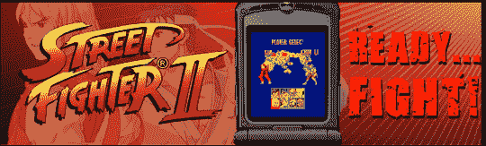

# 《街头霸王 2》选择手机:美国电话电报公司、T-Mobile 和 Sprint Only

> 原文：<https://web.archive.org/web/http://techcrunch.com/2007/08/08/street-fighter-ii-heads-to-select-cellphones-att-t-mobile-and-sprint-only/>

众所周知，说到电子游戏，我最喜欢格斗类游戏。那些游戏中，恐怕*街霸*还是我的最爱，后面还有 [*魂剑*](https://web.archive.org/web/20150912094558/http://crunchgear.com/2007/06/15/soul-calibur-iv-teaser-trailer-released-it-will-be-good-promise/) 。由于卡普空公司今年庆祝该系列的 20 周年，它在每一种可以想象的设备上发布了无数不同的版本，以从我们身上榨取更多的钱。(不过还好，既然是*街霸*。)即将推出的几十个版本中的第一个是 *Street Fighter II Mobile* ，它在& T、Sprint 和 T-Mobile 上运行。作为一个威瑞森人，我不能尝试它。:-(

因此，如果你的手机和提供商都兼容，并且你愿意为一个已经玩了 1000 次的游戏支付 7 美元，那么尽情享受吧。或者你可以像我一样，等待游戏的高清版在今年秋天登陆 Xbox Live。

[街头霸王二手机](https://web.archive.org/web/20150912094558/http://capcommobile.com/description.php?ProductID=3)