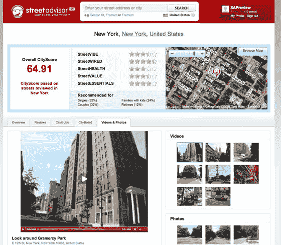

# StreetAdvisor 推出新服务

> 原文：<https://web.archive.org/web/http://www.techcrunch.com/2007/07/31/streetadvisor-launches-new-services/>

# StreetAdvisor 推出新服务

[street advisor](https://web.archive.org/web/20220818163003/http://www.streetadvisor.com/)今天将推出一系列新的升级，让房主、租房者和购房者对他们的居住地有一个更完整的了解。

新的 StreetAdvisor 提供了现实生活中的“内幕”视图，使用户能够以类似于旅游评论网站的方式了解和分享关于他们居住地点的重要细节，包括噪音水平、交通、邻居、娱乐和公共服务。关于当地商业、娱乐和服务的建议和负面经历也将得到支持。

StreetAdvisor 基于街道的评论已经扩展到包括城市、州和国家。

升级后的指南现在包括四大类别，能够以类似维基的方式创建更多主题。

其他新功能包括会员识别系统、“本地专家计划”和 StreetAdvisor 广告牌，这是一项能够确保每个城市独家“街头”广告机会的服务。

该网站目前处于公开测试阶段，覆盖美国、英国、加拿大和澳大利亚。

之前的 TechCrunch 报道[在这里](https://web.archive.org/web/20220818163003/http://www.beta.techcrunch.com/2007/03/29/take-neighborhood-gossip-to-a-whole-new-level/)。

