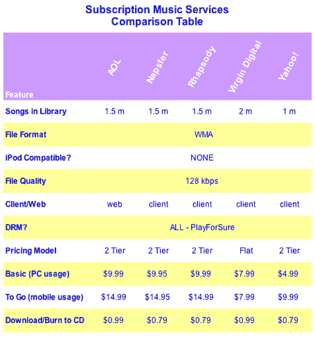

# 订阅音乐服务比较:第 2 部分——TechCrunch

> 原文：<https://web.archive.org/web/http://www.techcrunch.com:80/2006/04/11/subscription-music-services-compared-part-2/>

# 订阅音乐服务比较:第 2 部分

我们分析了销售数字音乐的服务，并在两部分的帖子中展示了结果。第 2 部分比较了订阅音乐服务，这些服务可以让您以每月一次的费用访问多达 200 万首歌曲的整个音乐库。上周四发布的第一部分，聚焦于付费下载服务(如 iTunes)。

虽然付费下载市场被苹果 iTunes 和准法律 AllofMP3 所主导，但订阅音乐市场是一个更加公平的竞争环境。有来自 [AOL](https://web.archive.org/web/20220117034551/http://aol.musicnow.com/) 、 [Napster](https://web.archive.org/web/20220117034551/http://www.napster.com/) 、 [Rhapsody](https://web.archive.org/web/20220117034551/http://www.rhapsody.com/) 、 [Virgin](https://web.archive.org/web/20220117034551/http://www.virgindigital.com/) 和 [Yahoo](https://web.archive.org/web/20220117034551/http://music.yahoo.com/unlimited) 的强大产品供应。

所有这些服务都向用户提供至少一百万首歌曲的音乐库，每月收取固定费用。这些产品通常分为三个主要部分:仅在 PC 上收听，允许将音乐移动到音乐设备的“to go”，以及允许歌曲永久所有权(使用 DRM)并可以刻录到 CD 上的可选下载服务。

请注意，这些服务都不适用于 iPod。它们都利用了微软的 PlayForSure DRM 技术，但这种技术与 iPod 不兼容。此外，这些服务都不能在 Mac 上运行。你必须有一台 Windows 机器才能使用它们，尽管 Rhapsody 有一些 Mac 功能。

## 音乐订阅服务

 **总的来说，基于纯统计的最佳服务是[维珍数码](https://web.archive.org/web/20220117034551/http://www.virgindigital.com/)** ，它拥有最大的音乐目录(200 万首歌曲)和最佳的整体价格 8 美元/月。与所有其他服务不同，维珍对 PC 版和 to go 版收费相同。维珍还拥有出色的附加功能，如用户对音乐的评论，营造社交氛围。

所有的服务都需要下载和使用特殊的播放器，除了 AOL，它使用基于网络的方法和 Windows Media Player。

对于最便宜的价格，雅虎的价格最低，基本计划是每月 5 美元(尽管 to go 计划是每月 10 美元，高于维珍的单一价格计划)。

但是基于用户体验的纯粹快乐， **Rhapsody 拥有最光滑的软件和最直观的用户界面。这是最贵的，每月 15 美元，但如果你想要最好的服务，这是值得的。**

谷歌和亚马逊都在开发在线音乐产品，并且肯定会有自己的引人注目的产品。