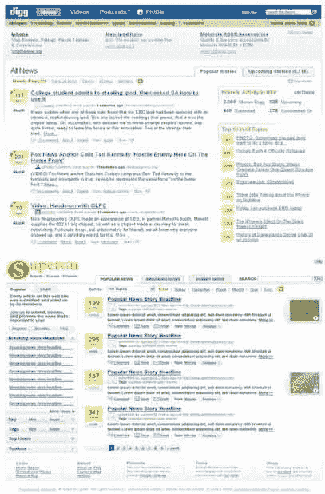

# 如果你抄袭 Digg，至少感谢他们

> 原文：<https://web.archive.org/web/http://www.techcrunch.com:80/2007/01/11/suggestion-if-you-copy-digg-at%20-least-thank-them/>

### 迈克尔·阿灵顿

 [go2web2](https://web.archive.org/web/20080129103605/http://go2web2.blogspot.com/2007/01/find-differences.html) ，通常是一个温和的博客，指出新的创业公司 [SuperGu](https://web.archive.org/web/20080129103605/http://www.supergu.com/) 复制了关于 Digg 的一切，除了他们的名字，并对他们有点反感。雪上加霜的是，他们[说](https://web.archive.org/web/20080129103605/http://www.techcrunch.com/wp-content/supergu565h.jpg)它“受到了 Meneame、Del.icio.us 和 Reddit 的启发”，完全忽略了 Digg。

截屏看起来几乎完全一样——super gu 不仅复制了 Digg 的理念，而且还复制了外观和感觉。我们将会看到 Digg 是否会激怒律师，还是会袖手旁观。

此条目发布于 2007 年 1 月 11 日星期四 2:01，归档于[公司&产品简介](https://web.archive.org/web/20080129103605/http://www.techcrunch.com/category/company-product-profiles/ "View all posts in Company & Product Profiles")下。您可以通过 [RSS 2.0](https://web.archive.org/web/20080129103605/http://www.techcrunch.com/2007/01/11/suggestion-if-you-copy-digg-at-least-thank-them/feed/) feed 关注该条目的任何回复。评论和 pings 目前都已关闭。