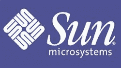

# 孙用剩余的彩票买下萨瓦耶

> 原文：<https://web.archive.org/web/http://techcrunch.com:80/2007/04/13/sun-buys-savaje-with-leftover-raffle-tickets/>

# 孙用剩下的彩券买了萨瓦耶

突发新闻，伙计们。Sun Microsystems 是 Java、Java Runtime Engine 和 Java 2 等热门产品的创造者，它收购了 SavaJe 的所有资产和知识产权，Sava je 是一家为手机开发基于 Java 的操作系统的初创公司。该公司现在已经停业了，这就是为什么 Sun 实际上有能力购买的原因，因为据我所知，Sun 并没有多少现金。目前还不知道 Sun 将如何处理从 SavaJe 那里获得的货物，因为该公司计划在 5 月份的 JavaOne 大会上宣布这一消息。

太阳微系统公司抢购 SavaJe