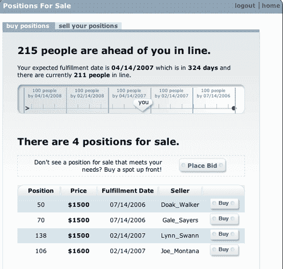

# SuperOyster:将等候名单货币化

> 原文：<https://web.archive.org/web/http://www.techcrunch.com:80/2006/05/24/superoyster-monetizing-the-waiting-list/>

# SuperOyster:将等候名单货币化

  从今天开始，总部位于西雅图的 [SuperOyster](https://web.archive.org/web/20220730222513/http://www.superoyster.com/) 向用户展示一些非常[早期的 alpha 代码](https://web.archive.org/web/20220730222513/http://alpha.superoyster.com/about)。

这项服务本月早些时候在 [O'Reilly Radar](https://web.archive.org/web/20220730222513/http://radar.oreilly.com/archives/2006/05/sell_your_place_in_line.html) 上有所介绍，它有一个创新而有争议的商业模式:允许人们在等候名单上排队购买和出售他们的位置。

这方面的主要市场是职业体育，购买季票的等候名单有时长达几十年。如果一支球队整合了 SuperOyster 解决方案，等待名单上的球迷将能够以整体市场决定的价格相互买卖这些位置。

我觉得这是好事。今天，人们通过等待来支付商品的费用。时间是有价值的，没有理由不像其他资产一样进行分配——根据市场。不太看重时间的人会愿意等待。更看重的人，不会。

其他人会不同意，认为“在我们日益商品化的世界中，剩下的为数不多的模糊的平等主义体验之一就是排队并轮到你”，正如一位评论者在上面的 O'Reilly post 中所说。马歇尔·柯克帕特里克指出了 SuperOyster 的另一个问题:“……公众知道你没有参加晚会，是因为你足够时髦，先知道了这件事，而是因为你买下了其他人的股份，这不是减轻了一定程度的时髦度吗？”

不管你的立场是什么，这种东西正在到来，互联网正在继续摧毁持续的市场低效率。

