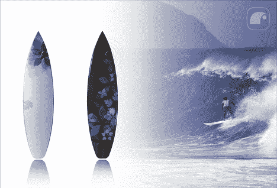

# 带双向无线电和 GPS 的冲浪板= Vaporware

> 原文：<https://web.archive.org/web/http://techcrunch.com/2007/07/06/surfboard-with-two-way-radio-and-gps-vaporware/>

# 带双向无线电和 GPS 的冲浪板=汽艇

冲浪者是一群奇怪的人，不太喜欢小玩意。当测试绑在我手腕上的相机和碍事的 MP3 播放器时，我感到很尴尬。所以这个冲浪板的概念让我担心，如果我从一个塑造者的角度来看的话。无线电和全球定位系统的单位将有一些周长，这不是一个好兆头，因为塑造者的重量比，抛出一切失去平衡。

短板的前端不可能容纳无线电和 GPS，因为它是短板最薄的部分。我可以看到它在长板或环氧树脂板上工作，但不是 PU 短板。我通常不需要无线电来与水中的其他人交流，因为我们都在同一个起飞点附近盘旋。如果我们走散了，我能理解为什么它会派上用场。没有经验的冲浪者(如果他们可以这样称呼自己的话)会被冲到海里，因为他们状态不佳，不知道自己要从哪里开始，所以无线电和 GPS 肯定会派上用场。艾迪·艾考恩当然可以使用全球定位系统。至少它比 IBM 的冲浪板要好。

Marco Torres 的内置无线电冲浪板【Yanko 设计】

更新-“冲浪收音机是由 lenartstudios 开发的，他拥有该产品的所有权利。要查看冲浪电台和更多来自
lenartstudios 的作品，请访问 www.lenartstudios.com“耶！