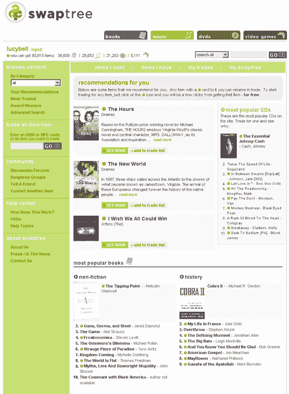
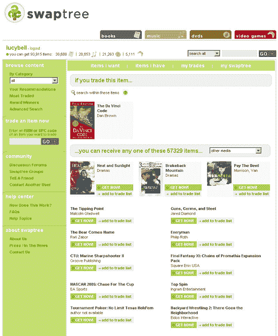
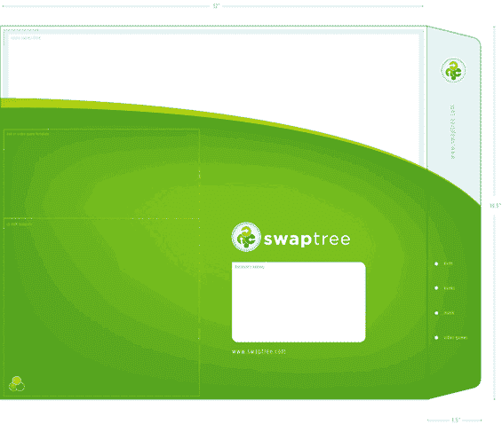

# 交换树更新，第一个屏幕截图

> 原文：<https://web.archive.org/web/http://www.techcrunch.com:80/2006/06/20/swaptree-update-first-screen-shots/>

  几周前，我写了一篇[有点负面的帖子](https://web.archive.org/web/20210803143752/http://www.beta.techcrunch.com/2006/06/02/i-like-swaptree-but/)，内容是关于波士顿一家名为 [Swaptree](https://web.archive.org/web/20210803143752/http://www.swaptree.com/) 的未上市初创公司。Ouriel 写了一篇[后续文章](https://web.archive.org/web/20210803143752/http://www.beta.techcrunch.com/2006/06/05/splitgames-vs-swaptree/)将 Swaptree(不利地)与一家名为 SplitGames 的法国服务进行比较。

从那时起，我有机会与 Swaptree 创始人兼首席执行官 Greg Boesel 详细讨论了我指出的该服务的一些明显缺点。那次谈话，以及他给我演示的令人瞠目结舌的演示，清楚地表明我对这项服务做出了一些不正确的假设。

Swaptree 将允许用户在不使用现金的情况下与其他用户交换媒体项目(书籍、CD、DVD 和视频游戏)。Swaptree 不会收取交易费，而是依靠将放在网站上的上下文广告收入。对于一个新用户来说，这个想法就是你输入一些你拥有的并且愿意交易的商品(使用 UPC 或者 ISBN 代码),你会看到成千上万的人们愿意用你的东西来交易的商品。

我的假设是，Swaptree 将很难创造需求曲线。让新用户输入一些他们愿意交易的东西很容易。让他们输入他们想要的东西，并把它们与他们已经要交易的东西联系起来会困难得多。在这篇文章的最后，我指出，实际货币是一种非常好的储值货币，这也是易贝如此成功的原因。

事实证明，Swaptree 实际上有一个相当有趣且简单得多的方法来构建物品的需求曲线。除了维护一个用户想要交易的物品列表之外，他们还简单地构建了一个他们想要拥有的物品的长列表。这个列表可以通过点击 Swaptree 网站上的项目来创建，甚至更简单的方法，如导入您的亚马逊愿望列表或使用插件直接点击亚马逊上的项目，并将它们包含在您的 Swaptree“愿望列表”中。当我看到演示的时候，我确信大量的用户会被吸引去做这件事。如果有匹配，你拥有的物品和你想要的物品之间的任何匹配，Swaptree 建议双方进行交易。如果双方都接受，交易被确认。

也有一些非常好的接触。Swaptree 将分析 have 和 want 列表，并尝试在多达四个用户之间组织交易，因此交易的可能数量将呈指数级增长。他们还允许你直接从打印机打印出地址表和邮资。扣除信用卡费用后，他们实际上在邮资销售上赔钱，但他们觉得这是提供的重要服务。他们也有可用的信封，当你用完旧信封时会自动寄给你新的。这个清单还在继续——基本上 Swaptree 在考虑细节方面做得非常好，让互换尽可能容易地发生(坦率地说，我希望易贝也能提供这种服务)。

有时候，我喜欢犯错。

这项服务离推出一个私人测试版还有一段时间，我将热切地参与其中。在[交换树主页](https://web.archive.org/web/20210803143752/http://www.swaptree.com/)注册。

屏幕截图:

