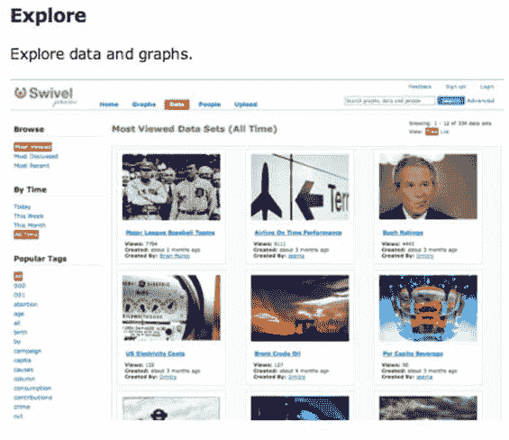
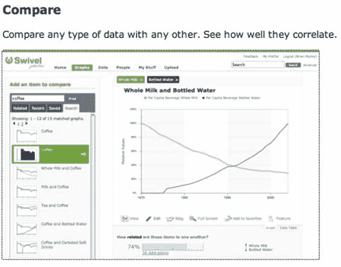
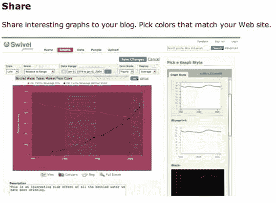

# Swivel 的目标是成为数据的互联网档案馆

> 原文：<https://web.archive.org/web/http://www.techcrunch.com:80/2006/12/05/swivel-to-launch-this-week-communitize-your-data>

# Swivel 的目标是成为数据的互联网档案馆

  [旋转](https://web.archive.org/web/20220811120749/http://www.swivel.com/)联合创始人德米特里·季莫夫和布莱恩·穆洛伊一开始将他们的公司描述为“数据的 YouTube”对于试图理解它的人来说，这是一个良好的开端，因为该网站允许用户上传数据——任何数据——并直观地展示给其他用户。你的网站产生的页面浏览量。或者一段时间内的股价。天气数据。商品价格。华盛顿州的秃鹰数量。随便啦。其他用户可以对上传的数据进行评级、评论和添加书签，这有助于将有趣的(和准确的)小麦从糟粕中分离出来。数据图表可以嵌入网站。所以它实际上有点像数据的 YouTube。

但是真正的乐趣开始了。然后，您和其他用户可以将该数据与其他数据集进行比较，以找到可能的相关性(或缺乏相关性)。将油价与总统支持率相比较，或将目击 UFO 与 iPod 销量相比较。根据硅谷的天气预报追踪你的网页浏览量。看看是否有有趣的事情发生。

更好的是，Swivel 会自动将你的数据与后台的其他数据集进行比较，向你提示你可能从未注意到的相关性。

学院派人士会为此而疯狂。我在大学里花了一个夏天运行经济数据的回归分析模型。如果能够简单地将数据上传到 Swivel，然后开始对数据进行分割，将会节省大量时间。能够将我们的数据与其他人在相关领域所做的进行比较，可能会产生我们从未想过的结果。大公司、小公司、智库和非机密的政府机构也会同样眼花缭乱。

Swivel 正在幕后投入大量计算能力来运行数据分析。*“我们在 Swivel 数据中心使用强大的计算机和算法，将一个由数字和字母组成的孤独网格转化为数百个——有时数千个——图表，这些图表可以在 Swivel 中进行探索并与任何其他公共数据进行比较。”*

不是所有的数据都会公开。该公司的商业模式是为公共数据免费提供服务，对私人数据收费。所有者仍然可以将私有数据与公共数据集进行比较。

经过一年的安静开发，本周晚些时候将发布 Swivel。该公司总部位于旧金山，是小型企业的一部分。

以下独家截图:

