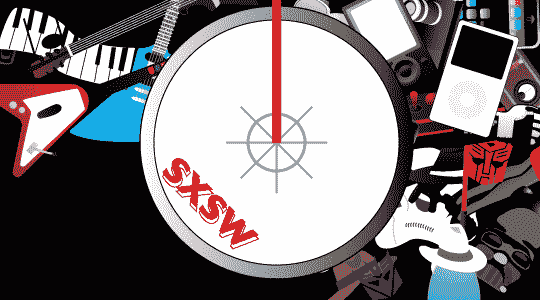

# SXSW 2007:德州中部万岁

> 原文：<https://web.archive.org/web/http://techcrunch.com:80/2007/03/10/sxsw-2007-all-hail-central-texas/>

有人愿意假设这里发生了什么吗？在周一之前发送电子邮件到 crunchgear dot com 参加比赛，赢取丰厚的奖品
好了，男孩女孩们，我现在已经在奥斯汀为今年的西南偏南奖(SXSW)扎下了根。我的 GDC 2007 之旅引发了一些有趣的话题，比如 Emotiv 的 Epoc 项目和一个很好的喉炎病例。这个声音是我经常听到的嘶哑的声音，但我正在尽我所能应付过去。我怀疑，没有什么是大量的酒精不能解决的。与此同时，我像个哑巴一样四处游荡，通过视觉和听觉吸收一切。

那么到目前为止我经历了什么？我很高兴你问了:

昨晚我乘坐一架满载 SXSW 狂欢者的飞机抵达奥斯汀。许多刚放春假的孩子准备在街上跑，在第六街制造一些麻烦。很难不对如此多的能量感到兴奋。毕竟，SXSW 是几个行业汇聚一堂，在鸡尾酒会上分享营火故事的一大借口。也有一些小乐队演奏，但没有人真正关心这些(说真的，我不只是花 160 美元买了一个腕带或任何东西，这是严格的专业)。

这花了一段时间，但我终于在我的酒店安顿下来，并前往会议中心登记。不幸的是，这里有很多人有同样的想法。然而，我感谢我的幸运星，他们比华盛顿特区的居民更有吸引力。那天晚上，我在水牛城台球俱乐部和一个博客聚会，在那里，我和我的许多雅虎朋友一起玩。朋友和酒 Jonnie 黑了一个人的标签。

星期六很早就开始了，至少开始的时候很亮。我设法租到了一辆雪佛兰 Malibu，因为我住的酒店离会场不止一步之遥。尽管我的车有 40 马力，说真的，它是阿莫-ped 的皮卡，但它设法让我及时赶到了与希捷会面的地点。

希捷将在今年的屏幕燃烧游戏中展示。它在大厅里设置了一个专门为电子游戏比赛定制的中心展位。我与希捷的代表杰伊和大卫坐下来，就公司的状况进行了一次有趣的讨论。根据他们的说法，希捷负责 Xbox 360 和 PlayStation 3 中的大部分硬盘。它还刚刚开发了一个 1.8 英寸的驱动器，我们可能会在不久的将来在 iPod 中看到。

然而，更有趣的是它将于今年发布的 1TB 硬盘。这些驱动器仅使用四个垂直数据存储的盘片。如果您算一下，这意味着每个盘片可以存储 250GB，所以我怀疑我们很快就会在商店货架上看到 250GB 的单盘片驱动器。我们还讨论了 Josh 在 CES 之后报道的 FreeAgent 系列，有关这些的更多信息，请查看他的文章。

然而，我对希捷的访问有着比简单谈论存储更重要的动机。事实上，我是带着一颗无私的心来到展位的。你看，希捷邀请我在它的摊位上参加一个游戏比赛，为我选择的一个慈善机构筹款。我接受了挑战，无私地用我的名誉去帮助[儿童乐园](https://web.archive.org/web/20160925073618/http://www.childsplaycharity.org/)的孩子们。如果我赢了，Child's Play 将获得希捷提供的一个全新的 750GB 硬盘——如果我输了，我将带着一堆没用的东西回家。

游戏是【T4 战斗之夜:第 3 轮。我以前从未玩过，但我没有让它影响到我。是为了孩子们，我不能输。我选择了愤怒的公牛，杰克·拉莫塔，和舒格·雷·伦纳德，他是一个专业舞蹈演员什么的。回合很激烈。苏格·雷绕着斗牛场做了一些复杂的交谊舞动作，公牛在他逃跑时很难追上他。最后，拉莫塔用一连串的上钩拳在里奥的脸上肆虐，最终用一记有力的左勾拳击中了他的右视网膜。

最终得分:儿童游戏 1-小舞者 0

《与星共舞》的人应该给那个叫舒格·雷的家伙打个电话。我认为他和埃米特·史密斯会合作得很好。