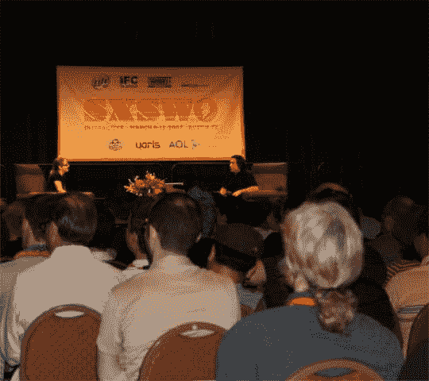

# SXSW 2007:菲尔托伦主题演讲| TechCrunch

> 原文：<https://web.archive.org/web/http://techcrunch.com/2007/03/11/sxsw-2007-phil-torrone-keynote/>

# SXSW 2007:菲尔托伦主题演讲

我坐在 Phil 的 keynote，疯狂的锐舞音乐在播放，人们拿着荧光棒在跳舞(不是真的)。我们只是坐在这里等待它开始。继续检查去生活博客这一个。

2:30–Phil 和 Limor 已经上台。他们正在讨论电子模块。有各种各样的很酷的 mod 正在被讨论。提到的一些主要的是 Linux 改装的 Linksys 路由器和 Roomba 机器人，它们被调整来做各种其他功能。据说这就是 iRobot 启动[哨兵项目](https://web.archive.org/web/20130628153349/http://crunchgear.com/2006/10/31/first-pic-of-irobots-sentinel-project/)的原因。

WordPress 是溅射，所以这可能不会立即

2:35–讨论转移到了知识共享。在 CC 上发布项目的好处。开源推动了整个创作过程，并有助于降低成本。

2:40–Limor 展示了一辆逆向设计的 Roland 301。听起来很完美。

2 点 43 分——带有示意图的巨型定位桩枪。

2:46–套件和 casemods 变得非常受欢迎。有一个视频正在播放。声音大得令人难以置信。

2:50–现在他们展示一个射频[信号干扰器](https://web.archive.org/web/20130628153349/http://make.blip.tv/file/116680)。菲尔和利莫尔做了一个电话演示。干扰器立刻屏蔽了通话。展出的频谱分析仪显示，当干扰器打开时，所有的信号都消失了。三星显然询问这项技术是否可以放入其手机中，以屏蔽周围的手机。

差不多就是这样。我们在问答区，人们漫无边际地试图用废话难倒菲尔。

好了，我现在要结束了。