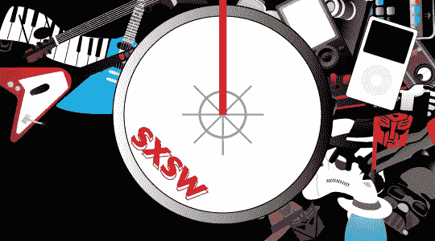

# SXSW:丹·拉瑟直播博客| TechCrunch

> 原文：<https://web.archive.org/web/http://www.techcrunch.com:80/2007/03/12/sxsw-liveblogging-dan-rather/>

# SXSW:丹·拉瑟博客直播

Blake 现在在 SXSW，并试图直播所有的主题演讲。在 PT 和他的朋友 Limor 打开手机干扰器并关闭他的 WAN 卡之前，他已经在博客上写了 [Phil Torrone](https://web.archive.org/web/20130628172332/http://crunchgear.com/2007/03/11/sxsw-2007-phil-torrone-keynote/) 做他的 *geekenwerk* 。去找一些关于重大事件的好报道吧。

[SXSW 2007:丹·拉瑟主题演讲](https://web.archive.org/web/20130628172332/http://crunchgear.com/2007/03/12/sxsw-2007-dan-rather-keynote/)