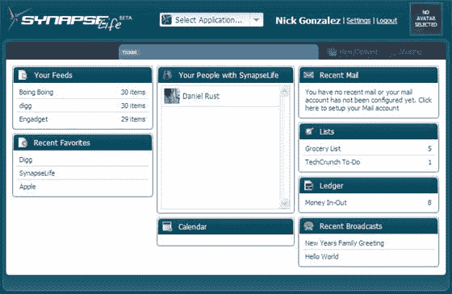
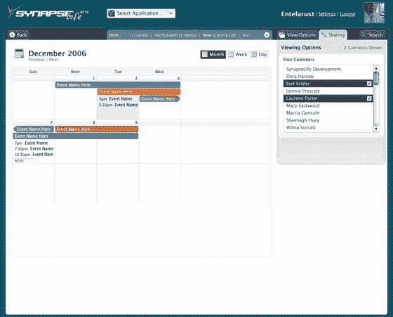

# SynapseLife 二期发布

> 原文：<https://web.archive.org/web/http://www.techcrunch.com:80/2007/01/09/synapselife-phase-2-launches/>

 [Synapse](https://web.archive.org/web/20160420165208/http://synapselife.com/) 是一个专注于业务的 Ajax 生产力套件(想想[Zimbra](https://web.archive.org/web/20160420165208/http://www.techcrunch.com/tag/zimbra)——电子邮件、日历等)。)我们在 8 月份第一次发布的时候[报道过。我们很容易忽略 syana PSE——公司网站叫嚣着 1998 年——但是我们已经花时间看了实际的应用程序，并得到了令人惊讶的满意结果。版本 2 将在未来几天内发布，包括浏览器工具栏扩展和用于导入/导出日历、OPML 和其他数据的工具。](https://web.archive.org/web/20160420165208/http://www.techcrunch.com/2006/08/31/synapselife-will-offer-lightweight-life-management/)

他们目前只提供托管的免费版本。仪表板有一个 Netvibes，基于模块的外观和感觉，其中电子邮件，日历，RSS 阅读器，书签，待办事项列表，基本的现金流分类帐(？)和同事(见图片)。点击一个模块，应用程序就会弹出。这项服务在移动设备上也运行良好。

SynapseLife 的问题在于，对于企业来说，它远不如 Zimbra 那样健壮，对于消费者来说，它也不如[Goowy](https://web.archive.org/web/20160420165208/http://www.techcrunch.com/tag/goowy)那样酷。无论如何，谷歌将继续占领这一领域——谷歌日历和 Gmail 是最好的在线应用。

SynapseLife 最大的成功可能是他们将很快发布一个 API，允许第三方为该服务创建模块，并将 synapse life 引入其他应用程序。这是一个由四名开发人员组成的自筹资金的团队——因此他们也足够灵活，能够随着时间的推移改变方向。

如果您对其他组织解决方案感兴趣，请查看尚未推出的 [LifeIO](https://web.archive.org/web/20160420165208/http://www.techcrunch.com/tag/Lifeio/) 和备受期待的 [Scrybe](https://web.archive.org/web/20160420165208/http://www.techcrunch.com/tag/Scrybe/) 。

