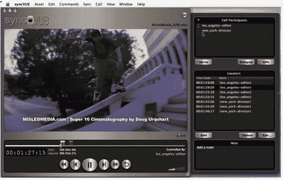

# SyncVUE: Skype 支持的协作视频编辑

> 原文：<https://web.archive.org/web/http://www.techcrunch.com:80/2006/11/14/syncvue-skype-powered-collaborative-video-editing/>

# SyncVUE: Skype 支持的协作视频编辑

  [SyncVUE](https://web.archive.org/web/20220706141212/http://syncvue.com/) 是一款让用户能够与 Skype 联系人同步视频或音频等媒体文件的产品，以便进行实时协作注释。这是对 Skype 网络的令人印象深刻的使用，这种方式可能会变得越来越普遍。在 [Skype Extras](https://web.archive.org/web/20220706141212/https://extras.skype.com/) 页面上有一个很长的插件列表，但这远不是一个详尽的列表。

SyncVUE 是一款将您的 Skype 联系人列表用作用户列表的产品。它允许您在媒体共享会话的参与者之间切换对同步文件的控制，或者随时关闭同步并独立播放文件。任何用户都可以在整个文件中放置时间标志和注释。这里有一个很好的[演示视频](https://web.archive.org/web/20220706141212/http://syncvue.com/movie_bkgd.htm)。它基于 Quicktime，支持 Final Cut Pro 的基本命令。该产品的第一个许可费将近 200 美元，所以它不适合普通用户。不过，任何在分布式团队中从事视频工作的人可能会觉得这非常有趣。

最近几周，我们已经讨论了共享工作区、开源网络会议和基于 VOIP 的产品。SnycVUE 与所有这些都有关，这是利用 Skype 的力量和市场支配地位的一个很好的方式。为什么易贝没有这样做呢？

