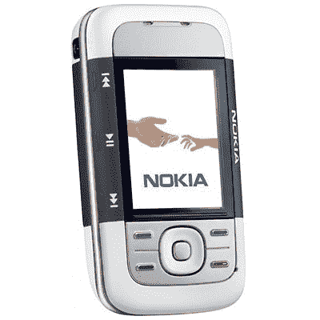

# T-Mobile 为诺基亚 5300 XpressMusic 做好准备| TechCrunch

> 原文：<https://web.archive.org/web/http://techcrunch.com/2007/02/14/t-mobile-gears-up-for-nokia-5300-xpressmusic/>

T-Mobile 已经开始为那些想要购买诺基亚 XpressMusic 5300 的用户进行预注册。要注册，只需访问 5300 的 [T-Mo 注册页面并注册即可。5300 配备了一些很棒的功能，如专用音乐按钮、有趣的滑块设计、microSD 等。2 月 28 日，根据你的合同谈判技巧，你可以以 99 美元或更高的价格买到一个。雅虎！Music 还与 T-Mobile 合作，提供免费曲目。](https://web.archive.org/web/20150424052212/http://www.t-mobileregistration.com/nokia5300)

事实上，我有一天得到了一个诺基亚 XpressMusic 5300，它是一个非常紧凑的小包装。给我一点时间来玩它，我会抛出一个评论。

可惜是 EDGE。

[T-Mobile 诺基亚 XpressMusic 5300 预注册](https://web.archive.org/web/20150424052212/http://www.t-mobileregistration.com/nokia5300)