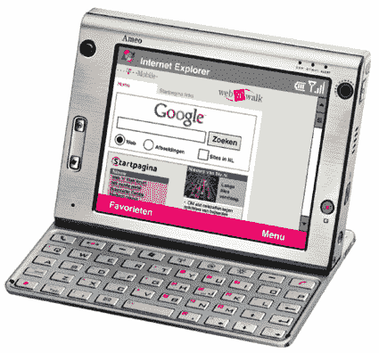

# T-Mobile 获得 HTC Athena 

> 原文：<https://web.archive.org/web/http://techcrunch.com/2007/01/24/t-mobile-getting-htc-athena/>

小心 T-Mo 的顾客们，一个新的坏男孩来到了(一个非常欧洲化的)小镇！T-Mobile 将在几周后在欧洲发布 HTC Athena“Ameo”。除了一开始就有一个疯狂的设计(尽管如此，它还是很可爱)，Ameo 将采用 Windows Mobile，一个令人惊叹的 *5 英寸 VGA 触摸屏*，8GB 硬盘空间用于存储你所有的~~色情~~媒体，四频 GSM，HSDPA，GPS，一个 300 万像素的摄像头，可以拍摄视频和图片，以及一个 624MHz XScale CPU。可悲的是，这个“手机”里面的 CPU 比我 2000 年的电脑还快。

说到牛肉。至于我们美国人是否会很快看到 Ameo 还很粗略，但这是有可能的。不知道这要花你多少钱，但不要指望它会便宜。

[T-Mobile 推出 HTC Athena“Ameo”](https://web.archive.org/web/20151007141904/http://www.engadgetmobile.com/2007/01/23/t-mobile-rolls-out-htc-athena-as-ameo/)【Engadget Mobile】