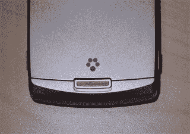

# T-Mobile 神秘标志| TechCrunch

> 原文：<https://web.archive.org/web/http://techcrunch.com/2006/09/13/t-mobile-mystery-logo-2/>

Gearlog 的 Sascha Segan 注意到 CTIA T-Mobile 展台传来奇怪的隆隆声。TMo 的许多新手机上都有五点标志。据说这个标志代表了一种尚未宣布的新服务。T-Mobile 表示，这项服务将“很快推出”一些可能性包括全球定位系统，个人传送器，自毁或某种数字媒体传送服务(好吧，我做了一半，你可以猜到是哪一种)。你们都觉得它代表了什么？
 [一个 Gearlog 之谜:这是什么 Logo？](https://web.archive.org/web/20140812125238/http://gearlog.com/blogs/gearlog/archive/2006/09/13/21008.aspx#Comments)