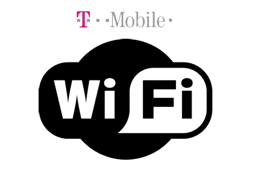

# T-Mobile 计划今年夏天推出无线手机服务

> 原文：<https://web.archive.org/web/http://techcrunch.com:80/2007/05/04/t-mobile-plans-cellphone-over-wifi-service-for-this-summer/>

你总是会得到不稳定的服务，从我个人的经验来看，T-Mo 在纽约遇到了一些麻烦。为了帮助解决这个问题，T-Mobile 将于今年夏天在家里推出 Hotspot，这项服务可以让即将推出的手机(来自诺基亚和三星)跳上 Wi-Fi 网络打电话。因此，如果你的房间或办公室手机信号不好，你的 Wi-Fi 网络可以用来打手机电话，而不是普通网络。肯定是那种“我为什么没想到”的时刻。

由于隔间居民白天不允许离开他们 3×3 英尺的平方，而且手机信号经常很差，分析师认为企业是家庭热点最先流行的地方。任何减少你每月必须购买的通话时间的事情都不是那么糟糕。

[Wi-Fi 如何扩展 T-Mobile 的覆盖范围](https://web.archive.org/web/20170506053913/http://online.wsj.com/article/SB117815938377190497.html?mod=technology_main_whats_news)【华尔街日报】