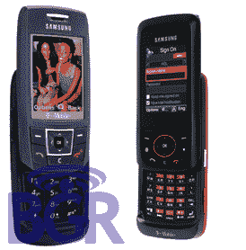
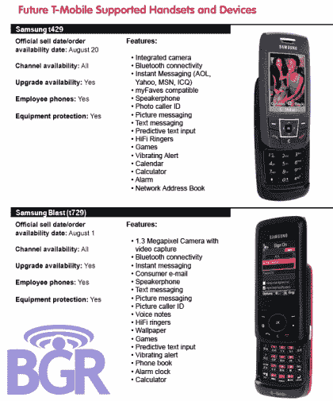

# T-Mobile 三星手机泄露

> 原文：<https://web.archive.org/web/http://techcrunch.com/2007/07/17/t-mobile-samsung-handsets-leaked/>

三星最新 T-Mobile 产品的细节已经泄露，如果你喜欢 QWERTYless 手机，那么 t429 和 t729 aka Blast 正好符合你的胃口。我只能嘲笑他们，因为我厌倦了，脾气暴躁。

t429 滑块集成了摄像头、蓝牙、IM 客户端、HiFi 振铃器和振动警报！它将于 8 月 20 日亮相。t729 或爆炸激起我的兴趣只是因为它的红色和黑色的花哨配色方案。如果你不喜欢智能手机，它的 130 万像素摄像头、视频功能、电子邮件支持和 SureType 键盘可能会引起你的兴趣。爆炸于 8 月 1 日落下。仅此而已。

[T-Mobile 三星发布详情！](https://web.archive.org/web/20131227194043/http://www.boygeniusreport.com/2007/07/16/t-mobile-samsung-launch-details/)【BGR】