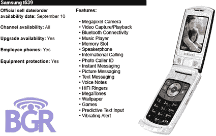

# T-Mobile 将于下月推出 UMTS/3G 网络？

> 原文：<https://web.archive.org/web/http://techcrunch.com:80/2007/08/14/t-mobile-set-to-launch-umts3g-network-next-month/>

BGR 公布了将于 9 月 10 日登陆 T-Mobile 的新款三星手机 t639 的清单。这是一款超薄翻盖手机，配有蓝牙、100 万像素摄像头、扬声器和许多其他小型翻盖手机通常拥有的低端功能。有趣的是，这是一部 3G UMTS 手机。在 T-Mobile 上。

对于那些没有心算的人来说，这款手机强烈暗示 T-Mobile 最终几乎准备好推出其最近布局的 3G 网络。目前，T-Mobile 是北美唯一没有 3G 的主要运营商，在技术方面已经落后了。但是通过从头开始建立一个全新的、可升级的网络，它已经准备好超越竞争对手。

事情正在悄悄进行，但 T-Mo 的 3G 网络有可能在同一天推出，加上其卓越的客户服务和体面的计划，使 T-Mobile 成为一个非常有趣的前景。

不到一个月 T-Mobile 的第一款 3G 手机问世【天才少年】