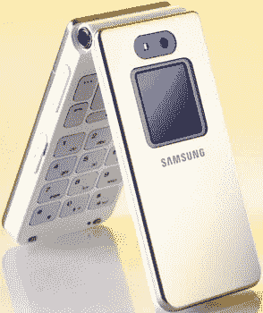

# T-Mobile 英国推出两款新手机

> 原文：<https://web.archive.org/web/http://techcrunch.com/2006/09/27/t-mobile-uk-launches-two-new-phones/>

# T-Mobile 英国推出两款新手机

T-Mobile 今天宣布将在英国推出两款新手机。首先是摩托罗拉 KRZR。对于那些不熟悉这款手机的人来说，它是 RAZR 的替代品。它的尺寸为 103 x 42 x 16mm 毫米，具有蓝牙、2MP 摄像头、microSD、MP3 播放、20MB 板载内存和 EDGE。我们也将在美国看到很多这样的手机。

另一款手机是三星 E870。它是香槟色的，有一个 130 万像素的摄像头和 80MB 的板载内存。

[T-Mobile 在英国推出摩托罗拉 KRZR](https://web.archive.org/web/20130819050038/http://www.reghardware.co.uk/2006/09/27/t-mobile_motokrzr/)【注册硬件】