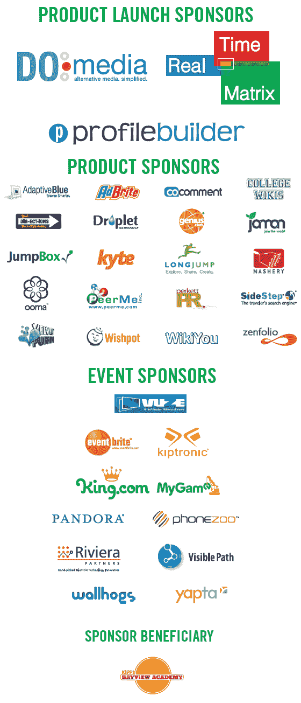

# 八月资本的 TechCrunch 9:感谢您的光临

> 原文：<https://web.archive.org/web/http://www.techcrunch.com:80/2007/07/28/techcrunch-9-at-august-capital-thank-you-for-coming/>

[http://www.viddler.com/player/4a41a3d2/](https://web.archive.org/web/20230218164747/http://www.viddler.com/player/4a41a3d2/)

好了，结束了。[昨晚在八月资本的 TechCrunch 9](https://web.archive.org/web/20230218164747/https://techcrunch.com/2007/06/05/techcrunch-party-at-august-capital-on-july-27/) 非常热闹，大约 900 人在展示产品，喝着酒，如果上面的视频有任何暗示的话，在寻找他们的梦中情人。公平地说，上面这位女士中的朱莉娅·艾莉森是福克斯电视台[的一名常规](https://web.archive.org/web/20230218164747/http://video.google.com/videosearch?hl=en&safe=off&client=firefox-a&rls=org.mozilla:en-US:official&hs=tde&q=julia+allison+youtube&um=1&sa=N&tab=wv)记者，她的朋友梅根·阿莎在一家对冲基金工作。他们只是和采访者莎拉·梅耶斯(Sarah Meyers)在镜头前玩得开心，她在去年的撞车事故后理所当然地出现在嘉宾名单上。

由于您对此次聚会的支持，我们得以向 [Kipp Bayview Academy](https://web.archive.org/web/20230218164747/http://www.kippbayview.org/) 捐赠 10，000 美元，用于为旧金山东南部的学校购买新的计算机设备。门票收入为 5000 美元，TechCrunch 为纪念我们的聚会提供了 5000 美元。

活动的照片——有很多——被贴上了标签 [TechCrunch9](https://web.archive.org/web/20230218164747/http://flickr.com/photos/tags/techcrunch9) 或[TechCrunch 2007 年 8 月](https://web.archive.org/web/20230218164747/http://flickr.com/photos/tags/techcrunchaugust2007)。我的在这里。官方摄影师 Zenfolio 的照片在这里。

非常感谢 David Hornik 和 August Capital 的团队在他们美妙的户外屋顶平台举办了我们的见面会。我们希望明年能再次被邀请。

特别要感谢我们的赞助商，是他们让这次聚会成为可能。许多额外的覆盖面(把你的链接发给我，我们会添加它):

[center networks](https://web.archive.org/web/20230218164747/http://www.centernetworks.com/liveblogging-techcrunch-party)
[Jeremiah Owyang](https://web.archive.org/web/20230218164747/http://www.web-strategist.com/blog/2007/07/28/photos-silicon-valley-elite-swarms-to-the-techcrunch-9-party/)
[Jessica Mah](https://web.archive.org/web/20230218164747/http://jessicamah.com/blog/?p=142)
[Dean Takahashi](https://web.archive.org/web/20230218164747/http://www.mercextra.com/blogs/takahashi/2007/07/28/the-techcrunch-meetup-party-tonight-were-going-to-party-like-its-1999/#more-239)
[Adaptive Blue](https://web.archive.org/web/20230218164747/http://blog.adaptiveblue.com/?p=479)
[Scott Beale](https://web.archive.org/web/20230218164747/http://laughingsquid.com/2nd-annual-techcrunch-party-at-august-capital/)
[Sarah Meyers](https://web.archive.org/web/20230218164747/http://sarahmeyers.wordpress.com/2007/07/28/tech-crunch-9-at-august-capital/)
[wish pot](https://web.archive.org/web/20230218164747/http://blogs.wishpot.com/wishpot/2007/07/techcrunch-meet.html)
Zoli Erdos
[Mario Sundar](https://web.archive.org/web/20230218164747/http://mariosundar.wordpress.com/2007/07/29/techcrunch-9-bigger-than-8-doh/)
[Blogot](https://web.archive.org/web/20230218164747/http://www.blogot.com/got/2007/07/techcrunch-9-1.html)

**产品发布赞助商:**
[DOmedia](https://web.archive.org/web/20230218164747/http://www.domedia.com/) 、 [Profile Builder](https://web.archive.org/web/20230218164747/http://www.profilebuilder.com/) 和[实时矩阵](https://web.archive.org/web/20230218164747/http://www.realtimematrix.com/)

**产品赞助商:**
[PeerMe](https://web.archive.org/web/20230218164747/http://www.peerme.com/) ，[水滴科技](https://web.archive.org/web/20230218164747/http://www.droplet-tech.com/)， [Jumpbox](https://web.archive.org/web/20230218164747/http://www.jumpbox.com/) ，[Genius.com](https://web.archive.org/web/20230218164747/http://www.genius.com/)， [coComment](https://web.archive.org/web/20230218164747/http://www.cocomment.com/) ， [LongJump](https://web.archive.org/web/20230218164747/http://www.longjump.com/) ， [Wikiyou](https://web.archive.org/web/20230218164747/http://www.wikiyou.com/) ， [Jaman](https://web.archive.org/web/20230218164747/http://www.jaman.com/) ， [Kyte.tv](https://web.archive.org/web/20230218164747/http://www.kyte.tv/) ， [Zenfolio](https://web.archive.org/web/20230218164747/http://www.zenfolio.com/) ，

**活动赞助商:**
[Kiptronic](https://web.archive.org/web/20230218164747/http://www.kiptronic.com/)[azure us/Vuze](https://web.archive.org/web/20230218164747/http://www.vuze.com/)[visible path](https://web.archive.org/web/20230218164747/http://www.visiblepath.com/)[Phonezoo](https://web.archive.org/web/20230218164747/http://www.phonezoo.com/)[King.com](https://web.archive.org/web/20230218164747/http://www.king.com/)[潘多拉](https://web.archive.org/web/20230218164747/http://www.pandora.com/)[里维埃拉合作伙伴](https://web.archive.org/web/20230218164747/http://www.rivierapartners.com/)和[雅普塔](https://web.archive.org/web/20230218164747/http://www.yapta.com/)。

还要感谢[斯托姆霍克](https://web.archive.org/web/20230218164747/http://www.stormhoek.com/)慷慨提供的葡萄酒，感谢休·麦克劳德和[豁口空](https://web.archive.org/web/20230218164747/http://www.gapingvoid.com/)提供的特殊纪念石版画，感谢[墙头猪](https://web.archive.org/web/20230218164747/http://www.wallhogs.com/)提供的展示桌标牌，感谢 [EventBrite](https://web.archive.org/web/20230218164747/http://www.eventbrite.com/) 提供的门票。

除了我们的官方媒体赞助商 [Kyte.tv](https://web.archive.org/web/20230218164747/http://www.kyte.tv/) 和 [Zenfolio](https://web.archive.org/web/20230218164747/http://www.zenfolio.com/) 之外，感谢 [Ustream.tv](https://web.archive.org/web/20230218164747/http://www.ustream.tv/) 、 [Justin.tv](https://web.archive.org/web/20230218164747/http://www.justin.tv/) 、 [Podtech](https://web.archive.org/web/20230218164747/http://www.podtech.net/) 和 Sara Meyers 的所有帮助。

