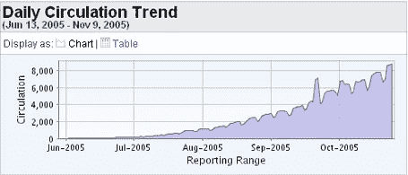
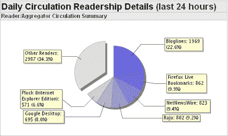
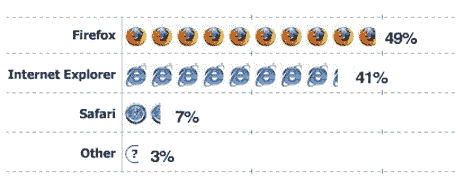

# TechCrunch–5 个月后–TechCrunch

> 原文：<https://web.archive.org/web/http://www.techcrunch.com:80/2005/11/10/techcrunch-after-6-months/>

明天，11 月 11 日，是 [TechCrunch](https://web.archive.org/web/20220527115544/http://www.beta.techcrunch.com/?page_id=120) 的五个月纪念日——我的[第一个公司简介](https://web.archive.org/web/20220527115544/http://www.beta.techcrunch.com/2005/06/11/technorati-new-improved/) (Technorati)是在 2005 年 6 月 11 日。

我写个人博客已经有一段时间了，但这是我第一次尝试为比我的直系亲属和朋友更多的读者写博客。这是一次美妙的经历——我通过编写 TechCrunch 直接或间接结识了无数新朋友(博客作者、读者、企业家、记者和风险投资家)。

如果你想知道我为什么创办 TechCrunch 以及它是如何发展的，请阅读我在这里发表的[我的文章](https://web.archive.org/web/20220527115544/http://www.crunchnotes.com/?p=2)在我创办的同伴博客上， [CrunchNotes](https://web.archive.org/web/20220527115544/http://www.crunchnotes.com/) (CrunchNotes 是我写我感兴趣但严格来说不属于 TechCrunch 的东西的地方)。

我想分享一些我觉得有趣的 TechCrunch 统计数据。

## 观众

读者以相当稳定的速度增长。我认为这反映了博客圈的普遍发展，也反映了我正在写的所有在网络上涌现的有趣的新公司的事实。要真正理解 web 2.0，你必须看看这些公司。我在这里只做这些。我们已经发展到每天大约 9000 名 RSS 读者。页面浏览量每天都在剧烈波动，这取决于有什么链接进来。(来自 feedburner)

## Feed 阅读器故障

我真的很喜欢看到 rss 阅读器在哪里阅读我的订阅。这些也有所变化，但当前细分(向上或向下舍入)为:

1.  博客-23%
2.  火狐直播是-10%
3.  网络新闻——9%
4.  罗约——9%
5.  谷歌互联网——8%
6.  勇气–7%
7.  剩余–34%

(来自 feedburner)

## 浏览器共享

我一直觉得有趣的是，Firefox 是 TechCrunch 读者中最受欢迎的浏览器，尽管他们的总市场份额只有 10%左右。这东西得吓吓微软…博客读者是早期采用者。

(来自 measuremap)

## 最受欢迎的帖子

以下是 TechCrunch 上最受欢迎的十篇帖子:

1.  [谷歌午餐](https://web.archive.org/web/20220527115544/http://www.beta.techcrunch.com/2005/11/04/google-lunch/)
2.  [85%的大学生使用脸书](https://web.archive.org/web/20220527115544/http://www.beta.techcrunch.com/2005/09/07/85-of-college-students-use-facebook/)
3.  [丽雅的第一张截图](https://web.archive.org/web/20220527115544/http://www.beta.techcrunch.com/2005/10/26/riya-prepares-to-launch-alpha/)
4.  [Windows Live——不仅仅是一个 Ajax 桌面](https://web.archive.org/web/20220527115544/http://www.beta.techcrunch.com/2005/11/01/windows-live-more-than-an-ajax-desktop/)
5.  [比较视频的 Flickrs](https://web.archive.org/web/20220527115544/http://www.beta.techcrunch.com/2005/11/06/the-flickrs-of-video/)
6.  [新雅虎地图展示 Flash 的力量](https://web.archive.org/web/20220527115544/http://www.beta.techcrunch.com/2005/11/02/new-yahoo-maps-shows-power-of-flash/)
7.  [前五大 Web 2.0 风险投资家](https://web.archive.org/web/20220527115544/http://www.beta.techcrunch.com/2005/10/19/top-five-web-20-venture-capitalists/)
8.  [谷歌瞄准 Del.icio.us](https://web.archive.org/web/20220527115544/http://www.beta.techcrunch.com/2005/10/11/google-bookmarks-tagging-launches/)
9.  [球体的第一个屏幕截图](https://web.archive.org/web/20220527115544/http://www.beta.techcrunch.com/2005/10/14/first-screen-shot-of-sphere/)
10.  [Flock 已经上线](https://web.archive.org/web/20220527115544/http://www.beta.techcrunch.com/2005/10/20/flock-is-launching-publicly-today/)

(来自 measuremap)

我想感谢每一个阅读这个博客的人，在这个博客中被提到的人，以及花时间链接、评论和给我建议的人。只要 TechCrunch 有趣，只要我热爱我所做的事情，我就会一直写下去(是的，我是一个业余爱好者)。