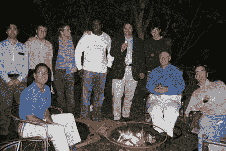

# 今晚的 TechCrunch 聚会

> 原文：<https://web.archive.org/web/http://www.techcrunch.com:80/2005/09/16/techcrunch-conference-tonight/>

# 今晚的 TechCrunch 聚会

今晚我们在加州阿瑟顿举行了一次 TechCrunch 烧烤。它开始时是一次非正式的聚会，但最终吸引了不少 web 2.0 企业家和博客作者。娱乐包括好市多汉堡和许多瓶加州好酒。

出席者包括[杰夫·克拉维尔](https://web.archive.org/web/20230307061633/http://blog.softtechvc.com/)、[克拉伦斯·伍登](https://web.archive.org/web/20230307061633/http://www.vpfund.com/archives/2005/04/clarence_wooten.html)、[查德·赫利](https://web.archive.org/web/20230307061633/http://www.youtube.com/)、迈克尔·杜兰、[尼维](https://web.archive.org/web/20230307061633/http://www.nivi.com/blog/)、[弗雷德里克·奥利维拉](https://web.archive.org/web/20230307061633/http://www.webreakstuff.com/)、丹尼尔·古尔德&布莱恩·诺加德(即将到来的酷炫新创公司)、蒂姆·凯[、基思·蒂尔](https://web.archive.org/web/20230307061633/http://www.archimedesventures.com/)、[德鲁·邓列维](https://web.archive.org/web/20230307061633/http://veraloft.net/)等人。

讨论范围从马克思与现实到 Web 2.0 的新内容。我们期待着每周都这样做，并邀请更多的企业家。感谢大家的参与。