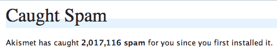

# 每天有 15，000 条垃圾评论

> 原文：<https://web.archive.org/web/http://www.techcrunch.com:80/2007/03/17/techcrunch-has-15000-spam-comments-per-day/>

# TechCrunch 每天有 15，000 条垃圾评论

1 月 4 日，我们报道说 [Akismet](https://web.archive.org/web/20220105043835/http://akismet.com/) 过滤器[阻止了一百万条垃圾评论](https://web.archive.org/web/20220105043835/http://www.beta.techcrunch.com/2007/01/04/thank-you-akismet/)到达 TechCrunch。那时我们已经用了大约九个月了。

仅仅十周之后，被屏蔽的垃圾评论数量现在已经达到了 200 万。这相当于每天有大约 15000 条垃圾评论攻击 TechCrunch。

如果我们没有 Akismet，我们就不能允许在 TechCrunch 上匿名评论。我们过去常常检查所有垃圾邮件评论，挑出偶尔的误报，并接受它。现在，有太多要经历的了。所有被 Akismet 标记为垃圾邮件的评论几乎都会被立即删除。

我们现在已经实现了一个 WordPress 推荐的定制插件，可以关闭超过两周的帖子的评论。这将大大减少点击博客的垃圾邮件总量，所以我不希望看到垃圾邮件总数继续呈指数增长。