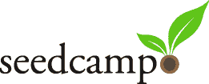

# TechCrunch 与 SeedCamp Europe 合作

> 原文：<https://web.archive.org/web/http://www.techcrunch.com:80/2007/07/19/techcrunch-partners-with-seedcamp-europe/>

# TechCrunch 与 SeedCamp Europe 合作

我们很高兴地宣布，TechCrunch 已经合作支持在欧洲推出 [SeedCamp](https://web.archive.org/web/20220521050959/http://www.seedcamp.com/) 。受 [YCombinator](https://web.archive.org/web/20220521050959/http://www.crunchbase.com/company/ycombinator) 和 [OpenCoffeeClub](https://web.archive.org/web/20220521050959/http://www.opencoffeeclub.org/) 的启发，Seedcamp 将于 9 月 3 日至 7 日在伦敦举行为期一周的活动，20 名年轻企业家将展示他们的早期战略和产品概念。

Seedcamp 的使命是通过提供资金、指导和媒体来帮助推进伟大的想法，从而培养欧洲的下一代企业家。在本周结束时，Seedcamp 将向€投资 5 万英镑，购买最终五个团队中每个团队 10%的股份，并在三个月内提供持续的指导和支持，为这些公司的正式融资做准备。

申请截止日期是 8 月 12 日。

TechCrunch 和《金融时报》是 Seedcamp 的独家媒体合作伙伴。我们支持 Seedcamp，因为我们相信它将有助于孵化欧洲年轻企业家的一些伟大的新产品，我们热衷于提供这一新举措的曝光率，并扩大我们的国际编辑覆盖面。我们在这个企业中没有经济利益。

Seedcamp 的想法来自 Saul Klein 在今年早些时候的一篇帖子中，他希望激励欧洲的创业社区。参与的风投和顾问包括 Index Ventures、Atomico Investments、Atlas Venture、Balderton Capital、TAG、Forsyth Group 和 Brown Rudnick。

我们还将在 Seedcamp 周的某个晚上在伦敦举办一场 TechCrunch 见面会。更多细节请见下文。