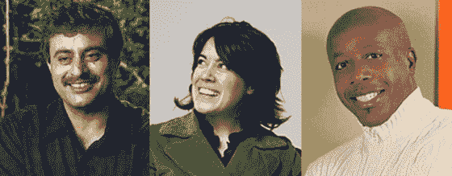

# TechCrunch20 大会:Caterina Fake、MC Hammer 和 Rajeev Motwani 加入专家小组

> 原文：<https://web.archive.org/web/http://www.techcrunch.com:80/2007/05/11/techcrunch20-conference-rajeev-motwani-caterina-fake-mc-hammer-join-expert-panel/>

# TechCrunch20 大会:Caterina Fake、MC Hammer 和 Rajeev Motwani 加入专家小组

我很兴奋地宣布今年九月在三藩市召开的 [TechCrunch20 会议的下三位专家。Caterina Fake、MC Hammer 和 Rajeev Motwani 加入了之前宣布的专家。完整的](https://web.archive.org/web/20221205084630/http://techcrunch20.com/)[专家小组在这里](https://web.archive.org/web/20221205084630/http://techcrunch20.com/panel-of-experts/)，我们将继续每周宣布新的专家..

专家小组将协助我们选择 20 家初创公司在大会上发布，并在他们发表演讲后参与讨论和评判初创公司。我们的目标是把一群不同的超级聪明和有趣的人聚集在一起，让活动尽可能精彩。

此外，我们很高兴地宣布[梅菲尔德基金](https://web.archive.org/web/20221205084630/http://www.mayfield.com/)成为 TechCrunch20 的特许赞助商。

活动[的注册在这里](https://web.archive.org/web/20221205084630/http://techcrunch20.com/register/)。在此提交您的公司在 TechCrunch20 [发布。在](https://web.archive.org/web/20221205084630/http://techcrunch20.com/submit-your-company/) [TechCrunch 20 博客](https://web.archive.org/web/20221205084630/http://www.techcrunch20.com/blog/)上了解会议的最新消息。

**卡特琳娜假**

Caterina Fake 是一位美国女商人和企业家。她最广为人知的身份是照片分享服务公司 Flickr 的联合创始人，该公司已被雅虎收购，她还是 Salon.com 的前艺术总监。她获得了许多奖项，包括《商业周刊》的 2005 年最佳领导者，福布斯 2005 年 eGang，快公司的 50 强，红鲱鱼的 20 位 35 岁以下的企业家和时代杂志的世界 100 位最具影响力的人。她是 Etsy 的董事会成员，为许多初创公司提供建议。在雅虎！Caterina 为 Brickhouse 经营战略，brick house 因其黑客技术 Yahoo！计划，对创新和创造力的刺激。

**MC 锤**

MC Hammer 是一位企业家和美国 MC，他在 20 世纪 80 年代末和 90 年代初将说唱音乐带给大众流行音乐听众，卖出了数百万张他的排行榜冠军专辑。他因对嘻哈文化和音乐的重要影响而闻名。2001 年 9 月 11 日恐怖袭击后，哈默在自己的 WorldHit 唱片公司发行了爱国专辑《现役》，并将部分收入捐给了 9/11 慈善机构。MC Hammer 在三一广播网有一个电视节目。哈默是秘密互联网初创公司[的顾问。](https://web.archive.org/web/20221205084630/http://www.dancejam.com/)

T5【拉吉夫】莫特瓦尼 

Rajeev Motwani 是斯坦福大学的计算机科学教授，同时也是研究生院的主任。他的研究兴趣包括:数据库和数据挖掘、网络搜索和信息检索、机器人和理论计算机科学。他是剑桥大学出版社出版的《随机化算法》一书的合著者。Motwani 获得了 Arthur P. Sloan 研究奖学金、国家科学基金会颁发的国家青年研究员奖、美以两国科学基金会颁发的博格曼纪念奖以及 IBM 教员奖。