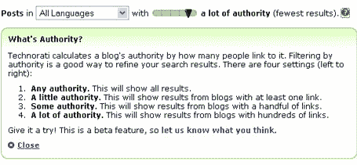

# Technorati 现在有了权威

> 原文：<https://web.archive.org/web/http://www.techcrunch.com/2006/02/13/technorati-now-has-authority/>

# Technorati 现在有了权力

  给实时搜索赋予某种质量是必要的。追踪一个特定帖子的链接是行不通的，因为，好吧，因为这些东西是实时的，没有时间去追踪链接。Memeorandum 确实可以近乎实时地跟踪博客文章链接，但它的博客索引非常小。在整个博客圈追踪这件事要困难得多。

Robert Scoble 指出 Technorati 已经尝试解决这个问题。他们悄悄地发布了一个“权威”滑块，允许对结果进行过滤。在任何地方都可以看到结果，从所有的博客，到只有数百个链接的博客。他们根据一个博客有多少链接来给一篇文章分配权限。下图显示了顶部的滑块，图像中的文本描述了它的工作原理。

滑块有点问题，但工作正常。这是人们对结果进行排序以找到他们想要的东西的另一种好方法。

史蒂夫鲁贝尔利用这个机会谈论一切是如何演变成一场大的人气竞赛的。他是对的…但是除了博客链接之外，还有什么更好的方法来确定权威呢？