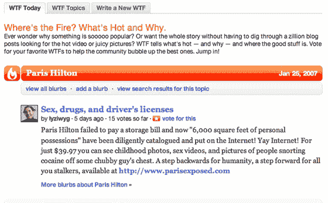

# Technorati 神秘消失的 WTF 产品

> 原文：<https://web.archive.org/web/http://www.techcrunch.com:80/2007/01/31/technoratis-mysterious-disappearing-wtf-product/>

# Technorati 神秘消失的 WTF 产品

史蒂夫鲁贝尔不知何故发现了一个新的类似 Digg 的 Technorati 产品，叫做“WTF”，代表“火在哪里？”它曾在 technorati.com/wtf 短暂直播过，但现在已经不可用了。

从截屏来看(见下文,《鲁贝尔的关怀》),它的功能似乎与 Digg 非常相似，用户可以为他们感兴趣的故事投票，并迫使它们在搜索结果中排名靠前。

我已经给 Technorati 发了电子邮件征求意见，但还没有收到回复。这可能是一个产品，他们并不打算提供给公众审查，鲁贝尔的帖子可能导致他们删除它。

2006 年初，Technorati 推出了一个类似于 TechMeme 的网站，名为[Technorati Explore](https://web.archive.org/web/20211027130908/http://kitchen.technorati.com/explore/)。我只是心血来潮，想看看它是否还在运行——它也已经被删除了。我找不到任何关于产品变暗的公告，所以可能是过去几个月的任何时候。

