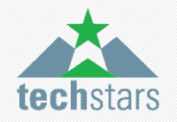

# TechStars:企业家夏令营(和现金)

> 原文：<https://web.archive.org/web/http://www.techcrunch.com:80/2007/01/25/techstars-summer-camp-for-entrepreneurs/>

# TechStars:企业家夏令营(和现金)

 [TechStars](https://web.archive.org/web/20221011042328/http://www.crunchbase.com/company/techstars) 是一家新的创业基金/孵化器，在 [TechCrunch 论坛](https://web.archive.org/web/20221011042328/http://forums.beta.techcrunch.com/forums/thread.jspa?messageID=6387)上引起了热烈的讨论。像 [YCombinator](https://web.archive.org/web/20221011042328/http://www.beta.techcrunch.com/2006/09/02/an-interview-with-vc-paul-graham-of-ycombinator/) 一样，TechStars 也在寻找仅有好的创业想法种子的一文不名的创业者。

他们正在接受申请，从中将选出 10 名优胜者。30 名获奖的企业家(TechStars 预计平均每个创意有 3 名创始人)将于 2007 年 5 月 21 日前往科罗拉多州，在博尔德度过一个夏天，打造他们的创意。TechStars 还将向每个创始团队提供 15，000 美元的种子资金，并帮助他们在博尔德的科罗拉多大学附近找到住房。TechStars 将在每个初创公司中获得 5%的股权。

这与 YCombinator 的模式相当，他们给每个创始人 6000 美元，并拿走创业公司 6-8%的股权。到目前为止，这种模式一直很有效，许多[有前途的初创公司推出了](https://web.archive.org/web/20221011042328/http://www.beta.techcrunch.com/2006/11/09/the-y-combinator-companies/)，由 YCombinator 资助的 [Reddit](https://web.archive.org/web/20221011042328/http://www.beta.techcrunch.com/2006/10/31/breaking-news-conde-nastwired-acquires-reddit/) 于去年万圣节被康泰纳仕收购。

TechStars 得到了来自大卫·科恩、布拉德·菲尔德、杰瑞德·波利斯(蓝山和普罗弗洛斯的创始人)和大卫·布朗的投资。还有一长串导师[和](https://web.archive.org/web/20221011042328/http://techstars.org/site/page/pg5883.html)承诺在夏天帮助指导创业。

我们看到了一个戏剧性的转变，因为(一些)投资者正从向过度投资的网络初创公司提供巨额资本转向这些结构化的、导师驱动的天使投资。YCombinator 和 TechStars 填补了一个明确的空白，Charles River Ventures 最近涉足小额(快速)投资也是如此。

今年夏天，我肯定会去至少一次 TechStars，做一些采访，并会见这些新的创业公司。TechStars 每年夏天都会重复这个项目。