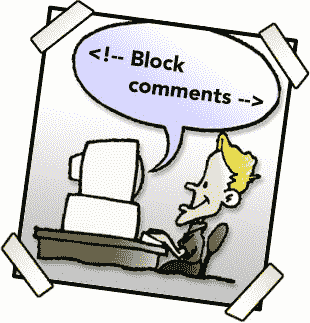

# 格兰。Be$T.Kommenter.Evar | TechCrunch

> 原文：<https://web.archive.org/web/http://techcrunch.com/2007/06/15/tehbetkommenterevar-8/>

欢迎再次来到另一个充满乐趣的最佳评论版。今天，CrunchDunce 在短暂中断后胜利回归，更多的苹果恶作剧激发了我们的一些最佳评论。

安迪·科格比尔对[计划淘汰](https://web.archive.org/web/20130628210122/http://crunchgear.com/2007/06/14/the-futurist-why-the-iphone-reeks-of-planned-obsolescence/)的分析为他赢得了第一名。

> Seth——你说得很有道理。你的评估可能也完全准确。但是这里必须问的更大的问题是，通俗地说，“是吗？那又怎样？?"
> 
> 苹果公司通过在特定的时间表推出新产品来赚钱，神秘的是，在新一代设备发布的当天，“消失”了上一代机型。计划淘汰是一种商业模式，苹果已经完善了这种模式。人们仍然会相互攀比几个月——可能接近一年——以获得第一代 iPhone，然后“噗”的一声，一款具有新功能的新产品将会上市。
> 
> 然后人们会想要那个。他们会忘记第一代，而渴望第二代——这包括第一代 iPhone 的用户。第三步，利润++。
> 
> 所以你和我可以一直谈论计划淘汰是多么令人讨厌，但最终，iPhones 仍然会在发布后的几个月内售罄，而苹果将会赚得盆满钵满。第二代的发布将会像第一代一样被大肆宣传，而且每个人都会喜欢苹果。

查克对 Safari 的印象让他排在第二位。

> "….Internet Explorer 和一些 Windows 用户似乎对苹果怀有敌意(为什么会有这种仇恨？是个哑巴公司)，…”
> 
> 不是讨厌，只是很多人厌倦了被告知某样东西更好，而它显然不是。
> 
> 999，999，我已经卸载了我的副本。

最后， **nightwing** 对 wii 的反应是*只有*和 xbox 一样强大，这让他挤进了今天的版本。

> 可惜这家伙数学不及格。Wii 的功能几乎是 GameCube 的 1.8 倍。GameCube 只比 X-box 稍微弱一点。尽管 Wii 没有着色器，但它的功能通常是 Xbox 的 1.5-1.7 倍。这是这个家伙显然忽略的一个基本事实。事实上，Wii 的观众对这款游戏机与目前市场上的其他两款系统相比动力不足没有任何疑虑，这使得他所说的更加多余。

现在，你点击“阅读这篇文章的其余部分”链接的原因…crunchdune。

我们今天的获胜者是在用大写字母写完他的全部评论并且基本上滥用了英语中的每一个语法规则之后赢得了这个有声望的位置。这是你应得的。

> 蹩脚的手机 200 美元+IPOD 250 美元= 450 美元
> 
> iphone = 600 美元
> 
> ULTMATE COOL FACTOR 售价 150 美元
> 
> 你想得太多，说得太多，你对此不满意，那就不要买
> 
> 其他人会成群结队——男孩喜欢用卡梅隆·迪亚兹的左手打电话，女孩喜欢对着贾斯汀的左手说话
> 
> IPHONE 最终会比 IPOD 大