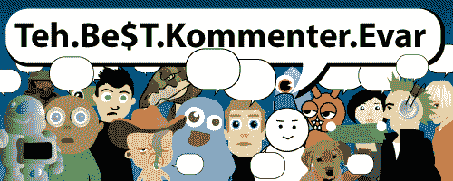

# 格兰。Be$T.Kommenter.Evar 

> 原文：<https://web.archive.org/web/http://techcrunch.com:80/2007/06/19/tehbetkommenterevar-draft/>

在今天的绿林中。Be$T.Kommenter.Evar 我们正在推出一个新的图形，其中包括我们可爱的鱿鱼。你们能说出它们的名字吗？

**特拉维斯**已经是一段时间的忠实读者，他对[英国视频游戏](https://web.archive.org/web/20140308133115/http://crunchgear.com/2007/06/19/manhunt-2-banned-in-the-uk-good-riddance/)惨败的两条评论为他赢得了第一名。

> 我同意禁止一个明显针对成人的视频游戏是非常愚蠢的。像这样的游戏是我们有收视率的原因——所以我可以买，而小提米不能。如果 BBC 下一步禁止暴力电影或含有脏话的音乐(不是从电台而是从商店销售)，你会说什么？任何形式的审查都应该被唾骂，而不是被称赞，即使你同意审查者的观点。忘记“滑坡”我说任何审查都是不好的，应该被禁止！
> 
> ***第二条评论***
> 
> 我有一个 2 岁的女儿，仍然认为禁止游戏、电影等没有意义。我永远不会让她玩这个游戏——但是为什么我不能在她上床睡觉或者在爷爷奶奶家过夜之后呢？我是一个同意的成年人，如果我愿意，应该可以玩这个游戏。如果我住在英国，我会很生气，因为我现在甚至没有选择。分级是为了防止孩子们玩不适合他们年龄的游戏——作为父母，我们必须尽自己的一份力量在家里实施这些分级——但我们不应该被阻止参与或观看游戏、电影等。我们选择购买的东西。

詹姆斯凭借他对德国小妞的反应获得第二名。

> 感谢上帝，她有先见之明，带了防护眼镜。

最后一个名额属于**查克**，他在[之前的](https://web.archive.org/web/20140308133115/http://crunchgear.com/2007/06/15/tehbetkommenterevar-8/)最佳解说中获得了第二名。他很好地总结了我们对希拉里·克林顿竞选的感受。

> 挑选竞选主题曲？当然，竞选自由世界领导人的人可以在她考虑竞选总统的 10 年中的某个时候实现这一目标。
> 
> 我几乎等不及 MySpace 上关于移民和医疗改革的求助。

下次请继续收听另一个激动人心的版本。成为$T.Kommenter.Evar

伙计们，再一次干得好！