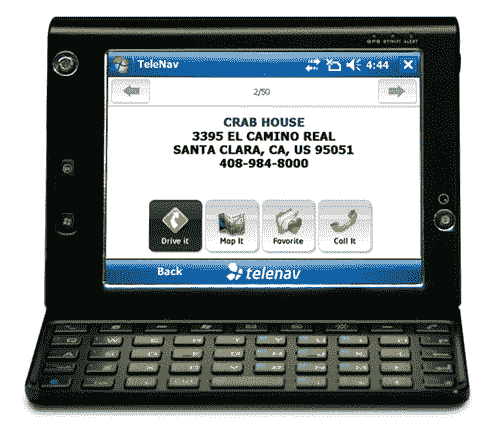

# HTC Advantage  上的 TeleNav Now

> 原文：<https://web.archive.org/web/http://techcrunch.com:80/2007/08/07/telenav-now-on-htc-advantage/>

我的家人最近染上了 [GPS](https://web.archive.org/web/20150912103447/http://crunchgear.com/category/gps/) 的毛病，可能是因为他们厌倦了每次走到比当地商场更远的地方时就跳到 MapQuest 上。他们问我会推荐哪些型号/软件，我说出了所有的大牌，包括 [TeleNav](https://web.archive.org/web/20150912103447/http://crunchgear.com/category/telenav/) ，现在可以在 [HTC Advantage](https://web.archive.org/web/20150912103447/http://crunchgear.com/2007/04/23/htc-advantage-video-unboxing-is-mindblowingly-amazing/) 上找到(确切地说是 TeleNav v5.1)。所有标准的 TeleNav 规则都适用于此，包括每月 9.99 美元的服务费用。

当然，你必须获得一个(或两个)优势，从今天起，它可以在 CompUSA 和 Amazon.com 购买，价格仅为 899 美元。显然，这是三天旅途中的完美装备。谁知道呢？

[电话导航](https://web.archive.org/web/20150912103447/http://www.telenav.com/)