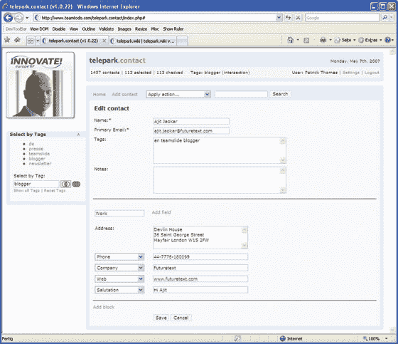

# telepark.contact:基于标签的联系人管理| TechCrunch

> 原文：<https://web.archive.org/web/http://www.techcrunch.com:80/2007/05/09/teleparkcontact-tag-based-contact-management/>

总部位于德国慕尼黑的 [telepark](https://web.archive.org/web/20150912072715/http://www.telepark.com/) 发布了 telepark.contact，这是一个基于标签的在线联系人管理平台，作为他们在 [Innovate！欧洲 2007](https://web.archive.org/web/20150912072715/http://www.innovate-events.com/2007/) 。

telepark 将新服务称为“联系人管理的 Flickr ”,虽然很容易对这种比较感到不满，但这并没有阻止我去看一看。

telepark.contact 允许用户使用标签轻松定义任意数量的联系人组。然后，只需点击一下鼠标，个性化电子邮件就可以一次发送给多达 4000 人。

用户可以向任何联系人添加任意数量的标签，允许创建单独的以及重叠的人群。该平台由标签优化选择系统支持，该系统建立在理论上允许比许多现有联系人管理系统更大范围的人员细分的平台上。

该系统还支持输入字段的动态创建。如果你有一个朋友有 5 个手机号码，这将是一种享受。

这项服务将于 5 月 16 日上线，起点是€249。

