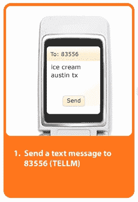
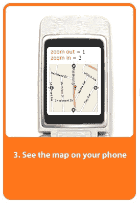

# Tellme 推出免费的 411 商务搜索服务 

> 原文：<https://web.archive.org/web/http://www.techcrunch.com:80/2007/04/16/tellme-launches-free-411-business-search-service/>

# Tellme 推出免费的 411 商务搜索服务

Tellme Networks 宣布将推出一项新服务，让用户在旅途中快速查找信息。该服务的功能类似于 411，但用户可以通过语音、短信或移动网络请求信息。通过在语音提示下请求“企业搜索”，该服务将允许您找到特定类别的企业，并根据位置返回本地结果。该声明是在[谷歌宣布](https://web.archive.org/web/20221006005557/http://www.beta.techcrunch.com/2007/0%204/06/google-launches-free-411-business/)其免费 411 服务 [Goog-411](https://web.archive.org/web/20221006005557/http://labs.google.com/goog411/index.html) 一周后发布的。

 

要通过语音使用这项服务，只需拨打 1.800.555.TELL。他们已经使用他们的 [TellMe Mobile](https://web.archive.org/web/20221006005557/http://www.beta.techcrunch.com/2007/01/23/tellme-mobile-launches/) 应用程序提供了这项服务，但这是第一次完全由语音控制。

[在 MobileCrunch 阅读更多信息…](https://web.archive.org/web/20221006005557/http://mobilecrunch.com/2007/04/16/tellme-launches-free-411-service/)