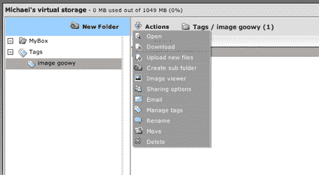

# 测试 Goowy 网络即时消息和在线存储

> 原文：<https://web.archive.org/web/http://www.techcrunch.com:80/2006/03/28/testing-goowy-web-im-and-online-storage/>

  [Goowy](https://web.archive.org/web/20151020152939/http://www.goowy.com/) 正在慢慢向用户推出其新的网络即时通讯和在线存储服务。本月早些时候我展示了截图(由 Goowy 提供)，现在有机会直接使用这些功能了。我的总体印象是:Goowy 正在成为一个非常好的基于 Flash 的桌面替代品，但在性能上还有一些问题需要解决。

**即时通讯**兼容性好(想想 Meebo——我在这里写过的[)。你可以使用 MSN，Yahoo，ICQ 和 AOL 账号或者直接和其他 Goowy 用户通话。设置很简单，而且运行完美。支持多种表情。我唯一的抱怨是，你给任何人发的第一条信息都写着“(使用 goowy web messenger 发送。在](https://web.archive.org/web/20151020152939/http://www.techcrunch.com/tag/Meebo/)[http://www.goowy.com](https://web.archive.org/web/20151020152939/http://www.goowy.com/))看看吧”真烦人。

Goowy IM 还不支持群聊，尽管首席执行官亚历克斯·巴德说这一天即将到来。另一个很好的特性是能够将聊天窗口从浏览器窗口中拉出，放入桌面上自己调整过大小的窗口中，看起来和感觉上更像一个标准的 IM 客户端。

**在线存储**(见最后的图片)也是一个非常好的新增功能。这不是他们自己造的。相反，他们在后端使用了 box.net 的 API。Goowy 向每个用户提供 1 GB 的免费存储空间，很快将提供每月 5 美元的 5 GB 存储空间。鉴于亚马逊最近设定的新定价基准，我预计这些价格会随着时间的推移而下降。Goowy storage 有一个简单的上传工具，文件可以被标记并设置为私有、公共或共享。

我在存储功能上看到的唯一问题是性能，它非常慢。这是可以理解的，因为该产品仍处于非常早期的私人 alpha 阶段，我预计在公开发布之前速度会大幅提高。Box.net 也需要尽早增加对客户端上传程序的支持。

Goowy 得到了马克·库班(Box.net 也是)和其他投资者的支持。流量[继续稳步上升](https://web.archive.org/web/20151020152939/http://www.alexaholic.com/goowy.com?y=r&r=2y&z=20)，根据之前博客上的评论，他们似乎有一个非常忠实的用户群。现在说 Goowy 的命运如何还为时过早，但我很高兴看到他们(以及 [Netvibes](https://web.archive.org/web/20151020152939/http://www.techcrunch.com/tag/Netvibes/) )开始远离人群。

