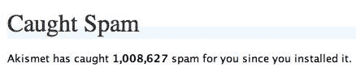

# 谢谢你，akis met

> 原文：<https://web.archive.org/web/http://www.techcrunch.com:80/2007/01/04/thank-you-akismet/>

在几天前的一篇[帖子中，我将博客垃圾邮件捕捉器](https://web.archive.org/web/20220805030657/http://www.beta.techcrunch.com/2007/01/02/2007-web-20-companies-i-couldnt-live-without/) [Akismet](https://web.archive.org/web/20220805030657/http://akismet.com/) 列为我不能没有的产品之一。今天，我们达到了神奇的数字——仅在 TechCrunch 上，Akismet 就捕获了超过 100 万条垃圾评论和引用。有超过 100 万条虚假内容，我们不必阅读、手动分类和删除。

如果你使用 WordPress，Akismet 是一个相对容易安装的插件，如果你想在另一个博客平台或网站上使用它，也有开发工具可用。如果你有博客，但不知道 Akismet，花点时间去看看吧。