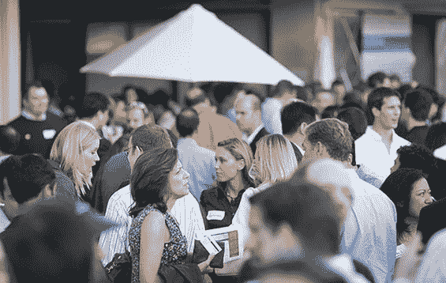

# 感谢您来到 TechCrunch 7 

> 原文：<https://web.archive.org/web/http://www.techcrunch.com:80/2006/08/19/thank-you-for-coming-to-techcrunch-7/>

# 感谢您来到 TechCrunch 7

昨晚的 TechCrunch 月资本派对取得了巨大成功(如果你把成功定义为警察在午夜出现在一家顶级风险基金的办公室关闭派对)。并非一切都很完美，但是酒和食物都很顺利，许多公司能够展示他们的产品。**感谢所有与会者，[感谢大卫](https://web.archive.org/web/20230216134419/http://p6.hostingprod.com/@www.ventureblog.com/articles/indiv/2006/001252.html)促成了这一切。** 

该事件的照片仍在发布——参见 [Flickr](https://web.archive.org/web/20230216134419/http://www.flickr.com/photos/tags/techcrunch7/) 、 [Zooomr](https://web.archive.org/web/20230216134419/http://beta.zooomr.com/smartsets/thomashawk/1800) 和其他照片分享网站上的“TechCrunch7”标签。

请参见 [TechMeme](https://web.archive.org/web/20230216134419/http://www.techmeme.com/060819/p27#a060819p27) 了解关于该事件的讨论。

下一站，纽约。在那里见。

**更新:**很多好的视频等链接。在评论里。

