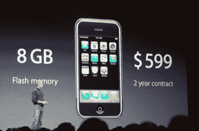

# 售价 599 美元的 iPhone 售价 220 美元

> 原文：<https://web.archive.org/web/http://www.techcrunch.com:80/2007/07/02/that-599-iphone-costs-220-to-make/>

# 售价 599 美元的 iPhone 售价 220 美元

作为我们之前关于[苹果 3 亿美元 iPhone 周末](https://web.archive.org/web/20230304093917/https://techcrunch.com/2007/07/02/iphone-has-a-250-300-million-opening-weekend/)的帖子的后续，一月份的估计猜测苹果在 iPhone 上赚了 20-50%(可能接近 20%)。

根据奥斯汀的 Portelligent 公司对一个单元的拆卸，新的估计认为组件的成本仅为 220 美元。这还不包括总装的费用。

最贵的部分是触摸屏，(大概)是德国一家叫 Balda 的公司生产的。这种屏幕的估计价格在 60 美元左右。三星生产了主要的微处理器芯片和 NAND 型闪存。

不太受欢迎的 4 GB 版 iPhone 的生产成本为 200 美元。