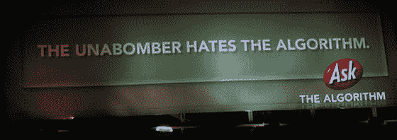

# 算法是令人不快的

> 原文：<https://web.archive.org/web/http://www.techcrunch.com:80/2007/05/29/the-algorithm-is-offensive/>

# 这种算法令人不快

自从我们第一次报道 Ask 算法活动[5 月 4 日](https://web.archive.org/web/20230301084027/https://techcrunch.com/2007/05/04/ask-is-the-algorithm-working/)以来，IAC 已经承诺 1 亿美元用于在全国范围内扩展 Crispin，Porter + Bogusky 设计的“病毒式”活动。最初对该算法的独立模糊引用已经被广告牌广告上的 Ask 标志所补充，这是一个积极的进步。

然而，有一个广告牌肯定会引起人们的注意，而且是出于所有错误的原因:

赵承熙，这位弗吉尼亚理工大学的射手可能也讨厌这个算法，他会出现在下一个广告牌上吗？

问思维究竟是什么？什么样的变态公司会用恐怖分子的名字来增加搜索引擎的市场份额？

假设这个算法找到了耶稣，你会认为这个算法也能找到敏感性训练。

整个广告活动的滑稽之处在于，Ask 实际上知道如何开展一场像样的广告活动。通过 FM 网络出现在 TechCrunch 上的 Ask 广告提供了引人注目的信息，甚至偶尔还有第三方产品代言。他们保持礼仪，同时为一个搜索引擎建立急需的产品和品牌意识，而大多数技术以外的人甚至没有听说过。对 6 个非技术/极客朋友做一个关于他们是否听说过 Ask 的民意测验，他们通常能得到的最接近的答案是 Ask Jeeves，他们通常会加上“这还在继续吗？”算法对这个群体毫无意义，这应该是 Ask 的核心目标市场。

(图片来自[搜索引擎圆桌会议](https://web.archive.org/web/20230301084027/http://www.seroundtable.com/archives/013576.html))