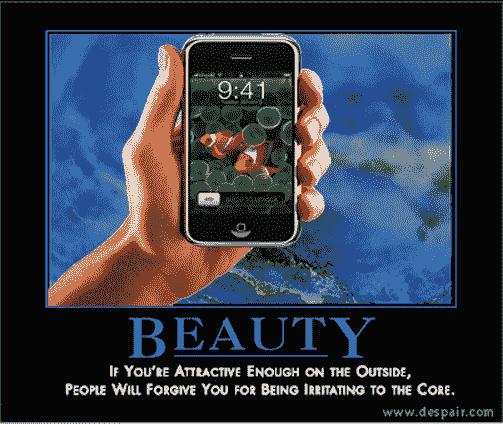

# 音频文件:偷拿 iPhone

> 原文：<https://web.archive.org/web/http://techcrunch.com:80/2007/06/29/the-audiofile-jacking-off-the-iphone/>

[iPhone](https://web.archive.org/web/20191224163946/http://crunchgear.com/2007/06/28/iphone/)今天掉落。如果你不知道，你可能已经死了，也不会读到这篇文章。如果你*知道*的话，希望你已经阅读了我们的早期评论综述。有一样东西特别吸引了我的眼球，但却很少引起毫无理由的猜测:iPhone 的耳机插孔。

你觉得你会把 iPhone 当成 iPod，配着你那花哨的配件耳机吗？想法不同(ly)。但是，这是苹果错失的赚钱机会，还是隐藏的秘密就在地平线之外的迹象？

iPhone 首先是一部手机。我不在乎它还能做什么。但是它也是一个 iPod，因此，即使它不能取代你的普通 iPod，听起来也应该是令人满意的。事实上，它支持超高质量的苹果无损音频格式，所以很可能有人会想从 Ultimate Ears 或舒尔插入一套 450 美元的耳塞来听所有闪亮的音乐。

但是他们不能。出于某种原因，苹果决定将耳机插孔设置在 iPhone 的机身中，以至于许多高端耳机都无法插入插孔，即使它是标准的八分之一英寸插头。

我的脑海中出现了一个危险信号，我立即想到这将是一个类似于“为 iPod 制造”计划的许可计划，苹果将向公司出售生产耳机适配器或带有 iPhone 兼容插头的耳机的许可证。但与耳机制造商 Ultimate Ears 的掌门人明迪·哈维(Mindy Harvey)的谈话显示，制造这两种配件根本不涉及许可费。

所以让我们来回顾一下:耳机插孔是凹进的，需要一个适配器或一个小外壳的直插头。但是苹果并没有从这个设计中赚到任何额外的钱。所以我一定要问，一本正经:WTF？

我打电话给苹果公司的公关团队，询问为什么该公司可能会设计出这样一个不方便的耳机插孔，认为我不会得到任何回应，因为该团队正在为产品的发布做准备。所以想象一下，当苹果公关代表西蒙·波普昨天给我回电话谈论这件事时，我有多惊讶！当然，他实际上并不在 iPhone 团队中——他主要在 iTunes 上工作。

当然，他说，在正式产品发布之前，他真的不能说太多，他甚至不知道耶稣手机这一特定方面背后的原因。但他确实说了两件非常诱人的事情:第一，他说“苹果不会轻易做出这样的设计。”换句话说，疯狂是有方法的。第二，他说下周，他会告诉我苹果深藏的袖子里有什么。

当然，适配器开始从 Belkin 这样的常见嫌疑人身上冒出来，各公司正在努力开发 iPhone 专用耳机型号。但是，耳机插孔设计背后的目的可能是什么，它似乎只是挫败了拥有标准 8 英寸插孔的目的？

另外，你见过[贝尔金适配器](https://web.archive.org/web/20191224163946/http://www.ilounge.com/index.php/ipod/review/belkin-headphone-adapter-for-iphone/)吗？你真的想要这样的东西挂在你性感的 iPhone 上吗？至少<a href = " http://www . macnn . com/articles/07/06/26/Shure . music . phone . adapter/"舒尔的适配器更实用(包括一个话筒)，而且外观也更好看……

对我来说，我就是不明白为什么苹果要冒险让 iPhone 变得哪怕只是有一点点不方便——或者至少不通过许可费从这种不方便中赚钱。请继续关注苹果公司的最新消息！

当然，如果你对为什么 iPhone 的插孔看起来有点问题有任何想法(抱歉，忍不住)，请在下面的评论区告诉我们。