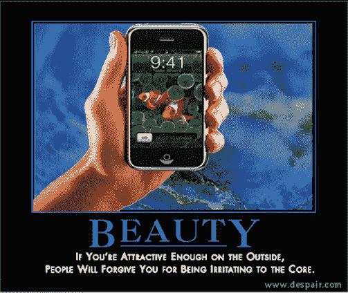

# 音频文件:可疑的 iPhone 活动

> 原文：<https://web.archive.org/web/http://techcrunch.com/2007/07/20/the-audiofile-suspicious-iphone-activities/>

前几天我正在骑自行车，这时我接到了苹果公司的电话。我把车停在路边，等到街角的灯变了，一部 iPhone 已经在去我公寓的路上了。我甚至没有要求一个，但 36 小时后，它来了。

果然，不到一个小时，我就情不自禁地查看电子邮件，并用它上网冲浪，就像一个孩子抓蚊子咬的地方一样。

我用它做了一些非常普通的事情:检查功能，加载音乐和视频，并找到一些抱怨的东西。但是有些人对 iPhone 感兴趣的不仅仅是基本功能。

我带着我的 iPhone 去了当地的酒吧，这样我就可以喝杯啤酒，在网上查看我的星座运势，在 T2 看一些 YouTube 视频。不到两分钟，一个看起来像疯子的家伙问我 iPhone 是不是很烂，作为对我 15 秒回答的回报，他请我喝了一杯啤酒！结论:iPhone 不是吸引女人的磁铁，但它能让你醉得一塌糊涂。

喝了几杯啤酒后，我开始对如何使用我的 iPhone 有了一些有趣的想法。首先，我把它放在我的后口袋里一个晚上——这是我自己的特殊酷刑测试——当我坐在一块石头上时，它在外壳的背面留下了一个漂亮的凹痕。但显然，这只是冰山一角。

以下是十大(国土安全部批准的)iPhone 活动:

1.向一群青少年大谈其对大脑的影响。
一名女子从她养满猫的房子里逃了出来，极力提醒一群青少年注意 iPhone 的危险。注意这些青少年反应的强度…更不用说这位女士意识到她看起来有多疯狂。这个视频让我感觉不舒服，就像看杰瑞·斯普林格一样。

2.[融合。](https://web.archive.org/web/20160422032817/http://www.willitblend.com/videos.aspx?type=unsafe&video=iphone)
这个《将它融合成苹果酱》的主持人的片段已经获得了无限的点击量——两次！让我感到不安的是，当这个家伙打开搅拌机时，他没有戴防护面具，破裂的电池开始冒出黑烟。我很自豪地说，我抑制住了尝试用我最近买的搅拌机来制作 iPhone 玛格丽塔酒的冲动。

3.看到 iPhone 就开始乱偷东西。
你知道这是一个新闻缓慢的日子，新闻本身也变成了新闻。当一名新闻记者采访一名早期 iPhone 测试者时，有人偷走了她的麦克风。如果有一个辅助摄像头来捕捉殴打场面就好了——这应该是为了*没有抢走 iPhone，而是*。

4.担心它会破坏社会。《商业周刊》矛盾声明部的布鲁斯·温斯坦博士说:“当我们用电子联系取代个人关系时，我们的社会结构正面临被撕裂的危险。社区的本质取决于我们彼此之间的联系。”我宁愿不去想史蒂夫·乔布斯有能力终结人类文明，但他有时的确令人印象深刻。

5.[吃吧。生吃的 iPhone，除非你把它混合起来，否则不会有同样的效果。或者至少用蛋糕做出来。](https://web.archive.org/web/20160422032817/http://kitchen.apartmenttherapy.com/food/silly/let-them-eat-iphone-cake-025510)

6.把它打得落花流水，让它知道你有多坚强。
Ars Technica 对 iPhone 做了一次“压力测试”。他们用钥匙插入，砍断，扔在地上。视频中的人做得很随意——我打赌续集中会有踩花和踢小狗的镜头。只要等到下一个版本的 iPhone 出来，完成像荆棘和激光束的防御。

7.制作一部关于它的音乐剧。大卫·波格(David Pogue)关于 iPhone 的音乐剧绝对是我在上映当天见过的最糟糕的事情。然而，像闪电舞一样，它在阳光下的日子短暂而甜蜜。

8.用它来为你的阴谋论辩护。不知道我是如何找到这个的，但这家伙试图建立一种非常奇怪的联系:苹果公司关于如何使用 iPhone 的视频教程在手机屏幕上显示了一些来自 NYtimes.com 的新闻标题。不知何故，这意味着苹果有一个政治议程。我一开始持怀疑态度，但苹果通常不会轻易做出营销决定。或许乔布斯正在为 2012 年总统大选搭建平台？

9.用它来代替人类的心脏。
一颗覆盖流动的人工心脏——[罗伯特·贾维克博士](https://web.archive.org/web/20160422032817/http://en.wikipedia.org/wiki/Robert_Jarvik)比不上史蒂夫·乔布斯！不过，看起来作为大脑移植会更好。

10.[把你的孩子打扮成一个](https://web.archive.org/web/20160422032817/http://gizmodo.com/gadgets/apple/cute-kid-in-iphone-costume-274061.php)。
(叹气。)用不了多久，iPhone 成瘾就会变成一种可诊断的病症。寻找问题的根源？别再看了。

只是不要在你的…呃… [家庭视频](https://web.archive.org/web/20160422032817/http://www.neogate.ro/iphone-sex-video/)中提到它——没有人认为那很热。