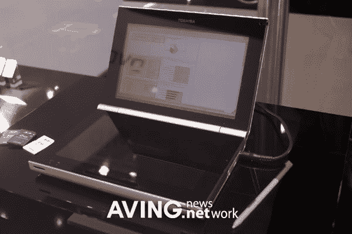

# 类固醇上的 ds | TechCrunch

> 原文：<https://web.archive.org/web/http://techcrunch.com:80/2006/09/08/the-ds-on-steroids/>

今天在柏林举行的 IFA 2006 上，东芝展示了一款新概念电子书“PDA ”,它有一个我们都应该看到的界面，双屏。这件事不只是一个真正甜蜜的 DS 欺骗，虽然。它有一个 SD 插槽，不可避免的手写笔，像冠军一样运行 Windows CE。我认为这很酷，但想想如果它更小，有视频电话功能，SD 卡可以容纳 20GB，那会有多酷。伙计，那会很甜蜜的。

[东芝展示“DS”电子书概念](https://web.archive.org/web/20160119115637/http://www.engadget.com/2006/09/08/toshiba-shows-off-ds-e-book-concept/)