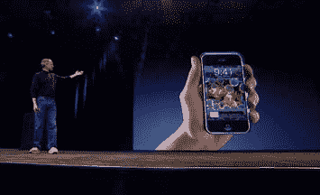

# 未来学家:iPhone 将如何改变移动设备

> 原文：<https://web.archive.org/web/http://techcrunch.com/2007/06/21/the-futurist-how-the-iphone-will-change-mobile-devices/>

# 未来学家:iPhone 将如何改变移动设备

在过去的几周里，我一直是 iPhone 一贯正确的反对者。虽然这里肯定有很多值得怀疑的地方，但 iPhone 有很多东西不仅真的很棒，而且可能从现在开始改变我们对移动设备的标准。

请继续阅读以了解…

 **电池寿命:**

不管我们对 Appple 的电池寿命声明有多么怀疑，为了能工作几分钟以上，iPhone 将需要比大多数手机在电池容量上有巨大的转变。对宽屏视频、WiFi 网络浏览和大量音乐收听的需求会在早上喝咖啡时削弱大多数手机。即使 iPhone 不符合苹果的要求，仅仅是设计这款设备就需要苹果想出一种方法，在一个小空间里填充比消费设备上曾经尝试过的更多的功能——这一壮举应该对未来所有移动设备的所有用户都有好处。当你看一看 Windows Mobile 设备时，情况尤其如此，这些设备是如此耗电，以至于有些设备实际上装有两块电池。

 **以电话为媒介**

关于 iPhone 被用作 AppleTV 的特设遥控器的谣言比比皆是。除了智能手机与电脑同步的时候，大多数移动设备都是有限的电话孤岛。如果苹果能够将手机改造成一个可以与你身边的众多小工具互动的自由控制器，它可以在很大程度上弥合硬件类别之间的差距。让我们只希望，这样的能力能够延伸到所有制造商，所以 iPhone 的这一方面并不局限于苹果制造的产品。

**不死机的操作系统**

Windows Mobile 会死机、崩溃，而且速度非常慢。不过，到目前为止，它在更多手机上可用，比任何其他智能手机操作系统都多。苹果所要做的就是拿出一款加载时间没有第一代 PlayStation 那么糟糕的产品，它应该会迫使其他操作系统制造商成形。

 **一股基于网络的移动应用热潮**

苹果的“烟与镜”SDK-through-Safari 仅仅因为逃避而招致了大量批评。尽管我很同意这一点，但我们并不难看到这条道路会在一夜之间导致大量的资源涌入专门为手机设计的基于网络的应用程序中——这一发展应该会让所有的移动用户受益(如果一个应用程序真的很棒，用不了多久它就会被移植到塞班和 Windows Mobile 上。)

*塞斯·波格斯在他的专栏《未来学家》中写道未来技术及其在个人电子产品中的作用。它每周四都会出现，过去专栏的档案在这里可以找到。*